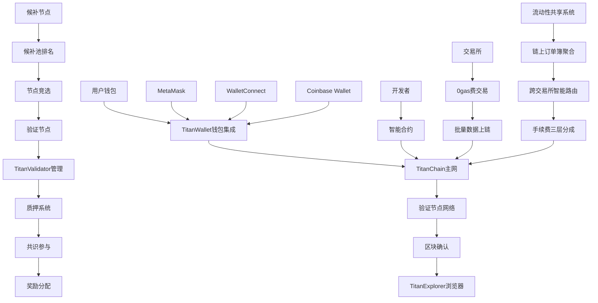

# TitanChain 产品需求文档 (PRD) - 第一阶段

## 1. 产品概述

TitanChain是一条高性能区块链网络，专注于构建下一代去中心化基础设施。第一阶段重点开发TitanChain主链和TitanExplorer区块链浏览器，为后续的去中心化交易所和生态应用奠定坚实基础。通过创新的共识机制和架构设计，实现20万TPS的超高吞吐量、低于100ms的极低延迟和0手续费的用户体验。

* **第一阶段目标**：构建高性能区块链主网和专业区块链浏览器，建立108个验证节点网络，实现TTN代币经济模型的基础运行。

* **市场定位**：面向全球区块链开发者、项目方和加密货币用户，提供高性能的区块链基础设施服务。

## 2. 核心特性

### 2.1 用户角色

| 角色   | 准入条件     | 核心权限                  |
| ---- | -------- | --------------------- |
| 普通用户 | 无门槛      | 转账、查询、智能合约交互等基础功能     |
| 项目方  | 代币发行申请   | 代币发行、智能合约部署、项目治理      |
| 开发者  | 技术认证     | 智能合约开发部署、DApp开发、API调用 |
| 验证节点 | 质押10万TTN | 区块验证、网络治理、收益分配        |
| 候补节点 | 持有TTN代币  | 参与节点竞选、社区治理投票         |

### 2.2 功能模块

TitanChain第一阶段包含以下核心模块：

1. **TitanChain主网**：高性能区块链网络，支持智能合约和基础转账功能
2. **TitanExplorer区块链浏览器**：提供实时数据查询和分析的专业区块链浏览器
3. **TitanStaking质押系统**：验证节点管理和代币质押奖励系统
4. **TitanWallet钱包集成**：支持主流以太坊钱包的无缝连接和管理
5. **TitanValidator验证端管理**：验证节点详细配置和候补节点信息展示
6. **TitanExchange交易所集成**：主链上部署的交易所0gas费交易数据上链
7. **TitanLiquidity原生流动性共享**：链上订单簿聚合，跨交易所流动性统一展示和交易

**后期规划模块**（第二阶段开发）：

* **TitanDEX去中心化交易所**：集成现货、期货、衍生品交易的综合交易平台

* **TitanBridge跨链桥**：支持多链资产无缝交互的跨链基础设施

### 2.3 页面详情

**第一阶段开发模块**：

| 模块名称                | 子模块     | 功能描述                                             |
| ------------------- | ------- | ------------------------------------------------ |
| TitanChain主网        | 共识机制    | 108个验证节点的PoS共识，支持20万TPS和<100ms延迟                 |
| TitanChain主网        | 智能合约    | 兼容EVM的智能合约执行环境，支持Solidity开发                      |
| TitanChain主网        | 基础转账    | TTN代币转账、余额查询、交易历史记录                              |
| TitanExplorer浏览器    | 交易查询    | 实时交易记录查询、交易状态跟踪、交易详情展示                           |
| TitanExplorer浏览器    | 区块信息    | 区块详情、区块高度、出块时间、验证节点信息                            |
| TitanExplorer浏览器    | 地址分析    | 地址余额、交易历史、代币持有情况、地址标签                            |
| TitanExplorer浏览器    | 合约监控    | 智能合约代码、调用记录、事件日志、合约验证                            |
| TitanExplorer浏览器    | 网络统计    | 实时TPS、网络健康度、节点分布、代币统计                            |
| TitanStaking质押      | 节点管理    | 验证节点注册、质押、考核和退出机制                                |
| TitanStaking质押      | 奖励分配    | 10亿TTN按块线性权重分配和收益统计                              |
| TitanWallet钱包集成     | 钱包连接    | 支持MetaMask、WalletConnect、Coinbase Wallet等主流以太坊钱包 |
| TitanWallet钱包集成     | 资产管理    | TTN余额显示、交易历史、多地址管理、资产概览                          |
| TitanWallet钱包集成     | 交易签名    | 安全的交易签名、智能合约交互、批量操作支持                            |
| TitanValidator验证端   | 节点配置    | 验证节点详细设置、硬件要求检测、网络配置优化                           |
| TitanValidator验证端   | 性能监控    | 实时性能指标、出块统计、网络延迟监控、告警系统                          |
| TitanValidator验证端   | 运营工具    | 节点启停管理、日志查看、故障诊断、自动化运维                           |
| TitanValidator验证端   | 候补节点展示  | 2000名候补节点排名、质押状态、竞选进度、晋升机制                       |
| TitanExchange交易集成   | 0gas费交易 | 交易所订单数据上链、0手续费机制、批量交易处理                          |
| TitanExchange交易集成   | 数据上链    | 交易记录存储、价格数据同步、流动性信息、市场深度                         |
| TitanExchange交易集成   | 链上验证    | 交易数据完整性验证、防篡改机制、审计追踪                             |
| TitanLiquidity流动性共享 | 全链统一订单簿 | 所有交易所订单统一到链上订单簿，实现真正的流动性统一                       |
| TitanLiquidity流动性共享 | 统一撮合引擎  | 链上智能合约自动撮合全网订单，最大化交易深度                           |
| TitanLiquidity流动性共享 | 跨所无缝交易  | 用户在任意前端下单，自动与全网最优订单撮合成交                          |
| TitanLiquidity流动性共享 | 手续费分成   | 成交所70%、流动性提供所20%、主链10%三层分成                       |
| TitanLiquidity流动性共享 | 深度聚合优化  | 所有交易所深度叠加，消除流动性碎片化问题                             |

**第二阶段规划模块**：

* TitanDEX交易所（现货、期货、衍生品交易）

* TitanBridge跨链桥（多链资产托管和跨链交易）

## 3. 核心流程

### 普通用户钱包使用流程

用户打开DApp → 选择钱包连接方式（MetaMask/WalletConnect等） → 钱包授权连接 → 查看TTN余额和资产 → 发起转账或合约交互 → 钱包签名确认 → 交易广播到TitanChain → 0gas费快速确认 → TitanExplorer显示交易详情

### 验证节点运营流程

候补节点质押10万TTN → 在候补池中排名竞争 → 当选后配置验证节点 → 通过TitanValidator管理界面监控性能 → 参与区块验证和共识 → 获得区块奖励 → 接受社区考核评估 → 维持节点运行或退出

### 候补节点竞选流程

用户质押TTN代币 → 加入2000名候补节点池 → 查看实时排名和竞选状态 → 参与社区治理提升权重 → 等待验证节点空缺 → 自动晋升为验证节点 → 开始节点运营

### 交易所0gas费交易流程

交易所用户下单 → 订单匹配成功 → 交易数据批量打包 → 0gas费上链TitanChain → 链上数据验证和存储 → TitanExplorer显示交易记录 → 用户查询交易证明

### 全链统一订单簿撮合流程

**具体撮合案例**：

1. **A交易所**提供流动性订单到全链统一订单簿
2. **B交易所**用户下单，链上撮合引擎自动匹配A的流动性
3. **成交完成**，手续费智能分成：A交易所20%（流动性提供方）+ B交易所70%（成交方）+ TitanChain主链10%（基础设施）
4. **结果同步**到所有交易所，用户享受全网最佳流动性和价格

**核心价值**：消除流动性碎片化，让所有交易所的深度统一叠加，大幅提升交易体验

### 开发者部署流程

开发者编写智能合约 → 通过钱包连接TitanChain → 部署合约到主网（0gas费） → 合约地址生成 → TitanExplorer显示合约信息 → 用户通过钱包与合约交互

## 4. 用户界面设计

### 4.1 设计风格

* **主色调**：深蓝色(#1E3A8A)和金色(#F59E0B)，体现专业性和价值感

* **辅助色**：灰色系(#6B7280, #F3F4F6)用于背景和文本

* **按钮风格**：圆角矩形，渐变效果，悬停状态变化

* **字体**：主标题使用Roboto Bold 24px，正文使用Inter Regular 14px

* **布局风格**：卡片式设计，顶部导航，响应式布局

* **图标风格**：线性图标，统一的视觉语言，支持深色模式

### 4.2 页面设计概览

| 页面名称            | 模块名称    | UI元素                                             |
| --------------- | ------- | ------------------------------------------------ |
| TitanExplorer首页 | 搜索功能    | 全局搜索框，支持交易哈希、地址、区块号、合约地址搜索                       |
| TitanExplorer首页 | 网络统计    | 实时TPS显示，区块高度，验证节点状态，网络健康度仪表盘                     |
| TitanExplorer首页 | 最新区块    | 区块列表，区块高度，出块时间，交易数量，验证节点信息                       |
| 交易详情页面          | 交易信息    | 交易哈希，发送方，接收方，金额，0gas费标识，状态确认                     |
| 地址详情页面          | 地址概览    | 余额显示，交易历史，代币持有，地址标签和备注                           |
| 合约详情页面          | 合约信息    | 合约代码，ABI接口，调用记录，事件日志，验证状态                        |
| 钱包连接页面          | 钱包选择    | MetaMask、WalletConnect、Coinbase Wallet连接按钮，二维码扫描 |
| 钱包管理页面          | 资产概览    | TTN余额卡片，交易历史列表，多地址切换，资产统计图表                      |
| 钱包管理页面          | 交易操作    | 转账表单，智能合约交互，批量操作，交易签名确认弹窗                        |
| 验证节点仪表板         | 节点配置    | 硬件检测状态，网络配置面板，性能优化建议，配置向导                        |
| 验证节点仪表板         | 性能监控    | 实时TPS图表，出块成功率，网络延迟监控，告警通知                        |
| 验证节点仪表板         | 运营工具    | 节点启停按钮，日志查看器，故障诊断工具，自动化设置                        |
| 候补节点页面          | 排名展示    | 2000名候补节点排行榜，质押数量，竞选进度条，晋升概率                     |
| 候补节点页面          | 质押管理    | 质押金额输入，锁定期显示，收益预估，风险提示                           |
| 节点管理页面          | 治理投票    | 提案列表，投票进度，投票权重显示，历史记录                            |
| 交易所集成页面         | 0gas费交易 | 交易批次列表，上链状态，数据完整性验证，查询接口                         |
| 交易所集成页面         | 数据监控    | 交易量统计，价格数据同步状态，流动性监控，市场深度图                       |
| 流动性共享页面         | 全链统一订单簿 | 所有交易所订单统一展示，实时深度叠加，全网最优价格                        |
| 流动性共享页面         | 统一撮合交易  | 链上撮合引擎界面，自动匹配全网订单，最大化成交深度                        |
| 流动性共享页面         | 深度聚合监控  | 全网流动性统计，深度叠加效果，碎片化消除程度                           |
| 流动性共享页面         | 分成统计    | 手续费分成实时统计，收益分配图表，历史分成记录                          |
| 流动性共享页面         | 撮合引擎监控  | 撮合效率统计，订单匹配速度，全链交易深度提升                           |

### 4.3 响应式设计

* **桌面优先**：主要面向专业交易者，优化大屏幕体验

* **移动适配**：支持手机端查看和基础交易功能

* **触控优化**：移动端增大按钮尺寸，优化手势操作

## 5. 技术架构需求

### 5.1 区块链网络架构

* **共识机制**：改进的PoS机制，108个验证节点竞争出块

* **性能指标**：TPS ≥ 200,000，区块确认时间 < 100ms，0手续费

* **网络拓扑**：分层网络架构，验证层、执行层、数据层分离

* **虚拟机**：兼容EVM，支持Solidity智能合约开发和部署

* **0gas费机制**：交易所批量交易免费上链，智能合约调用同发布者手续费分层（平台收取调用交易手续费20%）

### 5.2 钱包集成架构

* **多钱包支持**：兼容MetaMask、WalletConnect、Coinbase Wallet等主流钱包

* **EVM兼容性**：完全兼容以太坊钱包标准，无缝迁移用户体验

* **安全连接**：支持WalletConnect v2协议，安全的跨设备连接

* **批量操作**：支持批量交易签名，提升用户操作效率

### 5.3 区块链浏览器架构

* **数据索引**：实时同步区块链数据，建立高效索引系统

* **API服务**：提供RESTful API，支持交易、区块、地址查询

* **实时统计**：网络TPS、节点状态、代币分布等实时数据分析

* **用户界面**：响应式Web界面，支持多种设备访问

* **0gas费标识**：特殊标识0手续费交易，区分普通交易和交易所交易

### 5.4 验证节点管理架构

* **节点分布**：108个验证节点，全球地理分布

* **准入机制**：质押10万TTN，技术能力验证，硬件要求检测

* **退出机制**：性能考核，社区投票，自动替换机制

* **监控系统**：实时性能监控，告警系统，自动化运维工具

* **配置管理**：节点配置向导，硬件优化建议，网络配置自动化

### 5.5 候补节点系统架构

* **候补池管理**：2000名候补节点池，实时排名系统

* **竞选机制**：基于质押数量、治理参与度的综合评分

* **晋升算法**：自动化节点替换，公平的晋升机制

* **透明化展示**：实时排名、质押状态、竞选进度公开展示

### 5.6 质押系统架构

* **质押合约**：智能合约管理节点质押和奖励分配

* **多层质押**：验证节点10万TTN，候补节点1万TTN起

* **考核系统**：节点性能监控，自动化考核和评分

* **治理功能**：社区投票，提案管理，权重计算

### 5.7 交易所集成架构

* **批量上链**：交易所订单数据批量处理，降低网络负载

* **0gas费实现**：特殊交易类型，验证节点免费处理交易所数据

* **数据完整性**：链上数据验证，防篡改机制，审计追踪

* **API接口**：为交易所提供专用API，支持高频数据上链

### 5.8 全链统一订单簿撮合架构

* **全链统一订单簿**：所有交易所订单完全统一到链上，消除流动性碎片化

* **链上统一撮合引擎**：智能合约自动撮合全网订单，最大化交易深度

* **深度聚合优化**：所有交易所深度叠加，提供前所未有的流动性

* **三层手续费分成系统**：成交所70%、流动性提供所20%、主链10%

* **实时订单同步**：毫秒级全网订单同步，保证撮合实时性

* **统一交易体验**：用户享受全网最佳流动性，无需关心订单来源

* **智能撮合算法**：价格优先、时间优先，最优化订单匹配

## 6. 代币经济模型

### 6.1 TTN代币发行机制

* **总供应量**：20亿TTN

* **发行方式**：

  * **预挖部分**：10亿TTN（50%）先产出到指定合约

  * **挖矿奖励**：10亿TTN（50%）根据区块产出，奖励给节点验证者

### 6.2 预挖10亿TTN分配方案

* **生态发展基金**：5亿TTN（25%），用于生态建设、合作伙伴激励、项目孵化

* **团队预留**：3亿TTN（15%），4年线性释放，用于团队激励和长期发展

* **社区治理基金**：2亿TTN（10%），用于社区治理、公共产品资助、DAO运营

### 6.3 区块奖励10亿TTN释放机制

* **释放周期**：预计10年完全释放，每年释放1亿TTN

* **区块奖励计算**：

  * 初始区块奖励：每区块约19.03 TTN（基于年产1亿TTN，每年约525.6万个区块）

  * 奖励递减机制：每2年递减10%，确保长期激励平衡

  * 最小奖励保障：最低每区块1 TTN，维持网络安全激励

### 6.4 验证节点奖励分配

* **基础奖励**：每个验证节点平等分配区块基础奖励

* **权重奖励**：基于以下因素的权重分配：

  * 质押数量权重（40%）：质押TTN数量越多，权重越高

  * 性能权重（40%）：出块成功率、网络延迟、在线时长

  * 治理参与权重（20%）：参与提案投票、社区贡献度

* **奖励发放**：每个区块产生后实时分配，7天为一个结算周期

### 6.5 质押经济设计

* **验证节点质押**：最低10万TTN，最高无上限

* **候补节点质押**：最低1万TTN，参与候补池竞选

* **质押锁定期**：验证节点质押锁定30天，候补节点锁定7天

* **惩罚机制**：

  * 轻微违规：扣除当日奖励

  * 严重违规：扣除质押金额的1-5%

  * 恶意行为：永久移除验证资格，扣除全部质押

### 6.6 代币经济可持续性

* **通胀控制**：10年后区块奖励降至最低水平，主要依靠交易费用激励

* **价值捕获**：

  * 质押需求：验证节点和候补节点的质押需求

  * 治理价值：参与网络治理决策的投票权

  * 生态价值：作为生态内各种服务的支付媒介

* **长期激励**：通过生态发展基金持续投入，推动网络价值增长

## 7. 验收标准

### 7.1 主链性能指标

* **TPS性能**：实际测试TPS ≥ 200,000

* **延迟指标**：区块确认时间 < 100ms

* **手续费**：实现0手续费交易，包括交易所批量交易

* **系统稳定性**：99.9%可用性，故障恢复时间 < 30秒

### 7.2 钱包集成验收标准

* **钱包兼容性**：支持MetaMask、WalletConnect、Coinbase Wallet等主流钱包

* **连接稳定性**：钱包连接成功率 > 99%，连接时间 < 3秒

* **交易签名**：支持标准EIP-712签名，批量交易签名

* **用户体验**：钱包切换无缝，多地址管理，资产实时同步

### 7.3 验证节点管理验收标准

* **节点配置**：自动化配置向导，硬件检测准确率 > 95%

* **性能监控**：实时监控数据更新频率 < 5秒，告警响应时间 < 30秒

* **运营工具**：节点启停成功率 > 99%，日志查看实时性

* **候补节点**：2000名候补节点实时排名，晋升机制自动化

### 7.4 功能完整性

* **基础交易**：TTN代币转账、智能合约部署和调用

* **节点管理**：108个验证节点稳定运行，质押系统正常

* **浏览器功能**：实时数据展示，查询响应 < 1秒

* **智能合约**：完整的EVM兼容性，Solidity合约支持

* **0gas费交易**：交易所数据批量上链，免费交易机制

### 7.5 交易所集成验收标准

* **批量处理**：支持每批次1000+交易数据上链

* **数据完整性**：链上数据与交易所数据一致性 > 99.99%

* **API性能**：交易所API响应时间 < 100ms，并发支持 > 1000 QPS

* **0gas费实现**：交易所交易完全免费，无隐藏费用

### 7.6 安全性要求

* **智能合约审计**：核心合约通过第三方安全审计

* **节点安全**：验证节点防攻击机制，共识安全

* **系统安全**：防DDoS攻击，数据加密传输

* **钱包安全**：私钥本地存储，安全的签名机制

* **数据安全**：交易所数据加密传输，防篡改验证

* **代码开源**：核心代码开源，社区审查

### 7.4 用户体验

* **浏览器界面**：直观易用的区块链数据展示

* **响应速度**：页面加载时间 < 2秒，查询响应 < 1秒

* **移动适配**：区块链浏览器支持移动端访问

* **多语言**：支持中英德俄日韩阿拉伯文界面切换

