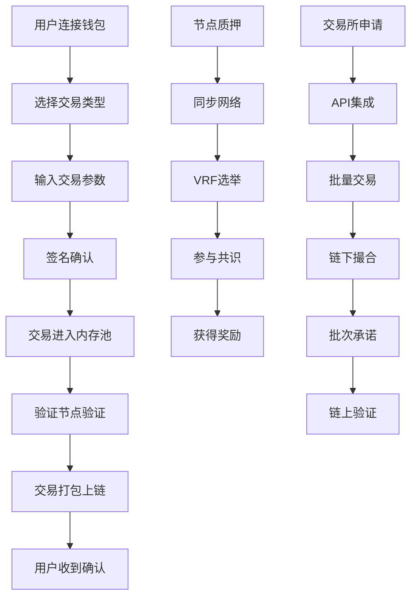
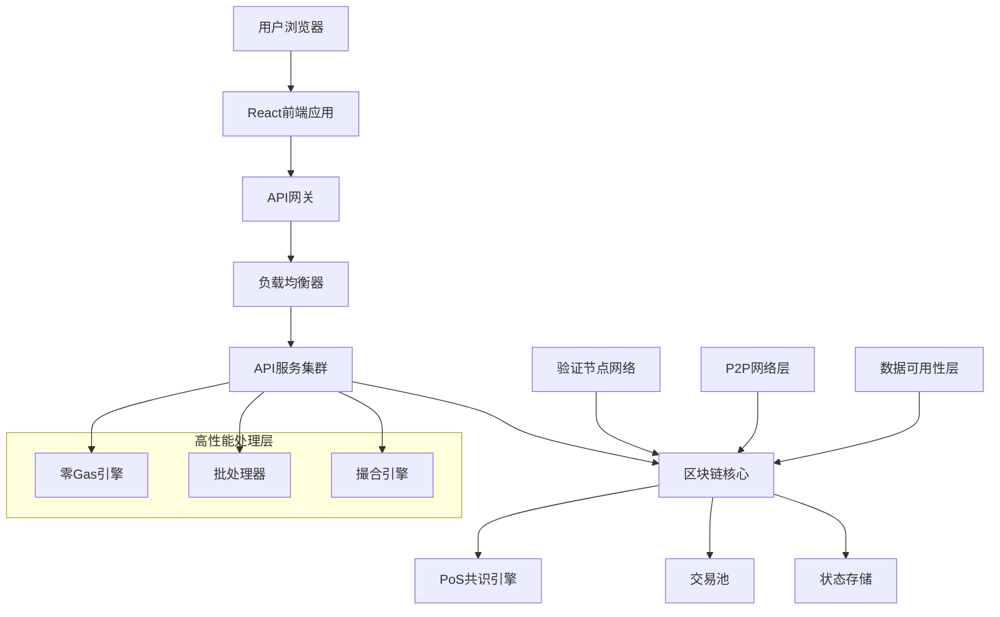

# TitanChain 产品需求文档 (PRD) - 完整版

## 1. 产品概述

TitanChain 是一条专为高频交易和金融应用设计的高性能区块链网络，致力于解决传统区块链在吞吐量、延迟和成本方面的核心痛点。通过创新的PoS共识机制、零手续费交易和链下撮合技术，为用户提供接近传统金融系统的交易体验。

**核心价值主张**：
- 实现200,000 TPS的超高吞吐量，满足大规模商业应用需求
- 提供低于100ms的极低延迟，确保实时交易体验  
- 支持零手续费交易，降低用户使用成本
- 构建去中心化治理体系，保障网络安全和公平性

**目标市场**：面向交易所、DeFi协议、支付服务商和企业级区块链应用，预期成为下一代金融基础设施的核心组件。

## 2. 核心功能

### 2.1 用户角色

| 角色 | 注册方式 | 核心权限 |
|------|----------|----------|
| 普通用户 | 钱包连接注册 | 发起交易、查看余额、参与治理投票 |
| 验证节点 | 质押注册（最低质押要求） | 参与共识、获得出块奖励、验证交易 |
| 候补节点 | 质押注册（较低质押要求） | 候选验证节点、获得候补奖励 |
| 交易所 | 白名单申请 | 批量交易、零手续费特权、API集成 |
| 开发者 | 开放注册 | 部署智能合约、调用API、访问开发工具 |

### 2.2 功能模块

TitanChain 产品包含以下核心页面和功能模块：

1. **主页**：网络概览、实时统计、快速导航
2. **钱包页面**：余额管理、交易历史、质押操作
3. **交易页面**：发送交易、交易状态、手续费设置
4. **验证节点页面**：节点管理、性能监控、奖励分配
5. **治理页面**：提案投票、参数调整、社区决策
6. **开发者页面**：API文档、SDK下载、测试工具
7. **区块浏览器**：区块查询、交易追踪、网络统计
8. **质押系统**：质押管理、收益计算、解质押操作

### 2.3 页面详情

| 页面名称 | 模块名称 | 功能描述 |
|----------|----------|----------|
| 主页 | 网络概览 | 显示实时TPS、活跃验证节点数量、网络健康状态；提供快速导航到各功能模块 |
| 主页 | 统计面板 | 展示24小时交易量、总锁仓价值、网络参与度等关键指标 |
| 钱包页面 | 余额管理 | 显示各代币余额、资产价值；支持多钱包切换和导入 |
| 钱包页面 | 交易历史 | 查看历史交易记录、交易状态、手续费详情；支持筛选和导出 |
| 交易页面 | 发送交易 | 输入收款地址、金额、备注；选择手续费级别；确认并发送交易 |
| 交易页面 | 批量交易 | 支持交易所批量提交交易；零手续费特权；批量状态监控 |
| 验证节点页面 | 节点注册 | 提交质押、设置节点信息、配置奖励地址 |
| 验证节点页面 | 性能监控 | 实时监控节点状态、出块统计、网络连接质量 |
| 验证节点页面 | 奖励管理 | 查看出块奖励、质押收益；设置奖励分配策略 |
| 治理页面 | 提案投票 | 查看活跃提案、投票权重、投票历史；参与社区治理 |
| 治理页面 | 参数调整 | 网络参数修改提案、技术升级投票、紧急治理 |
| 开发者页面 | API集成 | RESTful API文档、WebSocket接口、SDK使用指南 |
| 开发者页面 | 智能合约 | 合约部署工具、调试环境、Gas费估算 |
| 区块浏览器 | 区块查询 | 按高度或哈希查询区块；显示区块详情、包含交易列表 |
| 区块浏览器 | 交易追踪 | 按哈希查询交易；显示交易路径、确认状态、执行结果 |
| 质押系统 | 质押操作 | 选择验证节点、设置质押金额、确认质押交易 |
| 质押系统 | 收益管理 | 查看质押收益、复投操作、提取奖励 |

## 3. 核心流程

### 普通用户交易流程
1. 用户连接钱包（MetaMask/WalletConnect）
2. 选择交易类型（转账/合约调用）
3. 输入交易参数（地址、金额、Gas费）
4. 签名确认交易
5. 交易进入内存池等待打包
6. 验证节点验证并打包交易
7. 交易上链确认，用户收到通知

### 验证节点运营流程
1. 节点运营者准备质押资金
2. 部署节点软件并同步网络
3. 提交质押交易成为候补节点
4. 通过VRF算法选举成为活跃验证节点
5. 参与共识、验证交易、生产区块
6. 获得出块奖励和质押收益
7. 监控节点性能，避免被惩罚

### 交易所零手续费流程
1. 交易所申请白名单资格
2. 集成TitanChain API接口
3. 批量提交用户交易到专用通道
4. 链下撮合引擎处理订单匹配
5. 生成批次承诺并提交链上验证
6. 用户交易免费执行，交易所承担基础成本

### 治理参与流程
1. 社区成员或验证节点发起提案
2. 提案进入公示期，接受社区讨论
3. 质押用户根据质押权重进行投票
4. 投票期结束，统计投票结果
5. 提案通过则自动执行参数修改
6. 记录治理历史，保持透明度



## 4. 用户界面设计

### 4.1 设计风格

**主色调**：
- 主色：#1E40AF (深蓝色) - 体现专业性和可信度
- 辅色：#10B981 (翠绿色) - 表示成功状态和增长
- 警告色：#F59E0B (橙色) - 用于警告和注意事项
- 错误色：#EF4444 (红色) - 表示错误和危险操作

**按钮样式**：
- 主要按钮：圆角8px，渐变背景，悬停效果
- 次要按钮：边框样式，透明背景
- 危险按钮：红色背景，用于删除等操作

**字体规范**：
- 主标题：32px，Inter字体，font-weight: 700
- 副标题：24px，Inter字体，font-weight: 600  
- 正文：16px，Inter字体，font-weight: 400
- 小字：14px，Inter字体，font-weight: 400

**布局风格**：
- 卡片式设计，阴影效果增强层次感
- 顶部导航栏固定，侧边栏可收缩
- 响应式布局，支持桌面和移动端

**图标风格**：
- 使用Heroicons图标库，线性风格
- 统一16px和24px两种尺寸
- 支持主题色彩适配

### 4.2 页面设计概览

| 页面名称 | 模块名称 | UI元素 |
|----------|----------|--------|
| 主页 | 英雄区域 | 大标题、核心数据展示、渐变背景、动画效果；CTA按钮引导用户操作 |
| 主页 | 统计面板 | 网格布局的数据卡片、实时更新的数字、图表可视化、趋势指示器 |
| 钱包页面 | 余额卡片 | 代币图标、余额数字、美元价值、24h涨跌幅；操作按钮（发送/接收） |
| 钱包页面 | 交易列表 | 表格布局、交易哈希、时间戳、金额、状态标签；分页和筛选功能 |
| 交易页面 | 发送表单 | 输入框、下拉选择、滑块组件、预览卡片；实时Gas费估算 |
| 交易页面 | 确认弹窗 | 模态框、交易详情、风险提示、签名按钮；进度指示器 |
| 验证节点页面 | 节点卡片 | 状态指示灯、性能图表、奖励统计、操作菜单；健康度评分 |
| 验证节点页面 | 监控面板 | 实时图表、指标仪表盘、告警通知、日志查看器 |
| 治理页面 | 提案列表 | 卡片式布局、提案标题、投票进度条、时间倒计时、投票按钮 |
| 治理页面 | 投票界面 | 提案详情、投票选项、权重显示、确认对话框 |

### 4.3 响应式设计

**桌面端 (≥1024px)**：
- 三栏布局：侧边导航 + 主内容 + 信息面板
- 丰富的数据可视化和图表展示
- 悬停效果和动画增强交互体验

**平板端 (768px-1023px)**：
- 两栏布局：可收缩侧边栏 + 主内容
- 适配触摸操作，增大按钮和链接区域
- 简化部分复杂组件的显示

**移动端 (<768px)**：
- 单栏布局：底部导航 + 全屏内容
- 优化触摸交互，支持手势操作
- 关键功能优先显示，次要功能折叠

**触摸优化**：
- 按钮最小尺寸44px，确保易于点击
- 支持滑动、长按、双击等手势
- 提供触觉反馈和视觉反馈

## 5. 技术架构

### 5.1 系统架构



### 5.2 技术栈

**前端技术**：
- React 18 + TypeScript - 现代化前端框架
- Tailwind CSS - 原子化CSS框架
- Vite - 快速构建工具
- Ethers.js - 区块链交互库
- Wagmi - React区块链Hooks
- Web3Modal - 多钱包连接

**后端技术**：
- Node.js + Express - 服务端运行时
- TypeScript - 类型安全开发
- WebSocket - 实时数据推送
- Redis - 缓存和会话存储

**区块链技术**：
- 自研PoS共识算法
- VRF随机数生成
- BLS阈值签名
- Merkle树数据结构

**基础设施**：
- Docker容器化部署
- Nginx负载均衡
- PostgreSQL数据存储
- IPFS分布式存储

### 5.3 API设计

**核心API端点**：

```typescript
// 交易相关
POST /api/v1/transactions/submit
GET /api/v1/transactions/{hash}
GET /api/v1/transactions/pending

// 区块相关  
GET /api/v1/blocks/latest
GET /api/v1/blocks/{height}
GET /api/v1/blocks/{hash}

// 验证节点相关
GET /api/v1/validators
POST /api/v1/validators/register
GET /api/v1/validators/{address}/performance

// 治理相关
GET /api/v1/governance/proposals
POST /api/v1/governance/proposals/{id}/vote
GET /api/v1/governance/proposals/{id}/results

// 统计相关
GET /api/v1/stats/network
GET /api/v1/stats/performance
GET /api/v1/stats/validators
```

**WebSocket事件**：

```typescript
// 实时事件订阅
ws://api.titanchain.io/ws

// 事件类型
{
  "type": "new_block",
  "data": { "height": 12345, "hash": "0x...", "timestamp": 1640995200 }
}

{
  "type": "transaction_confirmed", 
  "data": { "hash": "0x...", "status": "success", "blockHeight": 12345 }
}

{
  "type": "validator_update",
  "data": { "address": "0x...", "status": "active", "performance": 0.98 }
}
```

## 6. 性能指标

### 6.1 核心性能目标

**吞吐量指标**：
- 峰值TPS：200,000笔/秒
- 持续TPS：150,000笔/秒  
- 零Gas交易TPS：100,000笔/秒
- 智能合约TPS：50,000笔/秒

**延迟指标**：
- 交易确认延迟：<100ms (P95)
- 区块生产间隔：1-2秒
- API响应延迟：<50ms (P95)
- WebSocket推送延迟：<10ms

**可用性指标**：
- 系统可用性：99.9%
- 验证节点在线率：>95%
- API服务可用性：99.95%
- 数据一致性：100%

### 6.2 扩展性设计

**水平扩展**：
- API服务支持无状态水平扩展
- 验证节点网络支持动态扩容
- 存储层支持分片和副本

**垂直扩展**：
- 单节点处理能力优化
- 内存和CPU使用效率提升
- 网络带宽充分利用

**负载均衡**：
- 地理分布式部署
- 智能路由和故障转移
- 自适应负载调整

## 7. 安全保障

### 7.1 共识安全

**PoS安全机制**：
- 最低质押要求防止女巫攻击
- 惩罚机制威慑恶意行为
- VRF随机选择防止预测攻击
- 多签验证增强安全性

**网络安全**：
- P2P网络加密通信
- 节点身份验证机制
- DDoS攻击防护
- 恶意节点检测和隔离

### 7.2 智能合约安全

**合约审计**：
- 静态代码分析
- 动态执行测试
- 形式化验证
- 第三方安全审计

**运行时保护**：
- Gas限制防止无限循环
- 重入攻击保护
- 整数溢出检查
- 权限控制验证

### 7.3 数据安全

**数据完整性**：
- Merkle树验证
- 数字签名保护
- 哈希链完整性
- 多副本一致性

**隐私保护**：
- 交易数据最小化
- 可选隐私交易
- 零知识证明支持
- 用户数据加密

## 8. 治理机制

### 8.1 去中心化治理

**治理参与者**：
- 验证节点：核心治理权重
- 质押用户：按质押比例投票
- 开发者：技术提案权限
- 社区：讨论和建议权

**治理流程**：
1. 提案提交（需要最低质押门槛）
2. 社区讨论期（7天）
3. 正式投票期（14天）
4. 执行期（自动或手动执行）
5. 效果评估和反馈

### 8.2 参数治理

**可治理参数**：
- 区块大小和出块时间
- 验证节点数量和质押要求
- 手续费率和奖励分配
- 惩罚机制和争议解决

**紧急治理**：
- 安全漏洞快速响应
- 网络攻击应急处理
- 关键参数紧急调整
- 多签紧急暂停机制

## 9. 生态建设

### 9.1 开发者生态

**开发工具**：
- SDK和API文档
- 智能合约开发框架
- 测试网络和水龙头
- 代码示例和教程

**激励计划**：
- 开发者资助计划
- 黑客马拉松活动
- 技术社区建设
- 开源贡献奖励

### 9.2 应用生态

**核心应用**：
- 去中心化交易所
- 借贷和流动性挖矿
- 稳定币和支付应用
- NFT市场和游戏

**合作伙伴**：
- 中心化交易所集成
- 钱包服务商合作
- 企业级客户对接
- 金融机构合作

## 10. 路线图

### 10.1 发展阶段

**第一阶段 - 主网启动 (Q1 2024)**：
- 核心功能上线
- 验证节点网络建立
- 基础生态应用部署
- 安全审计完成

**第二阶段 - 生态扩展 (Q2-Q3 2024)**：
- 交易所集成完成
- DeFi生态建设
- 跨链桥接实现
- 企业级应用对接

**第三阶段 - 全球化 (Q4 2024-Q1 2025)**：
- 国际市场拓展
- 监管合规完善
- 机构级服务推出
- 生态基金设立

**第四阶段 - 创新突破 (2025+)**：
- Layer 2解决方案
- 隐私计算集成
- AI和IoT应用支持
- 下一代共识算法

### 10.2 里程碑指标

**技术里程碑**：
- 主网TPS达到100k+
- 验证节点数量达到108个
- 智能合约部署数量10k+
- 日活跃用户数100k+

**生态里程碑**：
- TVL达到10亿美元
- 合作交易所20家+
- 开发者数量1000+
- 企业客户100家+

## 11. 风险评估

### 11.1 技术风险

**性能风险**：
- 高并发下的系统稳定性
- 网络拥堵时的服务质量
- 硬件资源的扩展瓶颈

**安全风险**：
- 智能合约漏洞风险
- 共识算法攻击风险
- 密钥管理安全风险

**缓解措施**：
- 全面的压力测试
- 多层安全审计
- 渐进式功能发布
- 应急响应机制

### 11.2 市场风险

**竞争风险**：
- 其他高性能区块链竞争
- 传统金融系统改进
- 监管政策变化影响

**采用风险**：
- 用户接受度不足
- 开发者生态建设缓慢
- 企业客户获取困难

**应对策略**：
- 差异化竞争优势
- 积极的市场推广
- 强化合作伙伴关系
- 持续的产品创新

## 12. 成功指标

### 12.1 关键绩效指标 (KPI)

**用户指标**：
- 月活跃用户数 (MAU)
- 用户留存率
- 新用户获取成本
- 用户满意度评分

**技术指标**：
- 网络TPS和延迟
- 系统可用性
- 安全事件数量
- 性能基准达成率

**生态指标**：
- 总锁仓价值 (TVL)
- 日交易量
- 开发者活跃度
- 合作伙伴数量

### 12.2 长期愿景

TitanChain致力于成为全球领先的高性能区块链基础设施，为数字经济提供安全、高效、可扩展的底层支撑。通过持续的技术创新和生态建设，推动区块链技术在金融、供应链、物联网等领域的广泛应用，最终实现真正的去中心化数字世界。

**愿景目标**：
- 成为全球前三的高性能区块链平台
- 服务1000万+用户和10万+开发者
- 支撑万亿级数字资产流转
- 推动区块链技术主流化采用