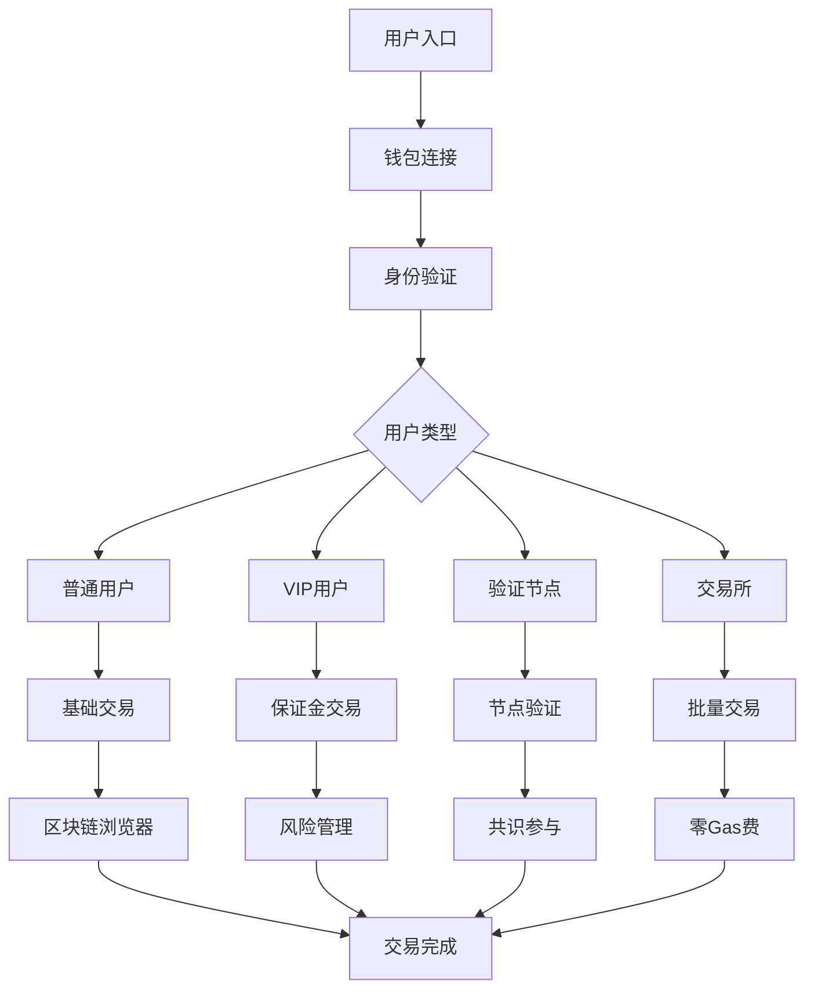

# TitanChain 产品需求文档 (PRD) - 最终版

## 1. 产品概述

TitanChain是一条高性能区块链网络，专注于构建下一代去中心化基础设施，实现20万TPS的超高吞吐量和低于100ms的极低延迟。
项目通过混合双区块架构、智能交易路由、分层性能处理和多层次安全防护，为交易所和DeFi应用提供企业级的区块链解决方案。
TitanChain致力于成为全球领先的高性能区块链平台，支撑万亿级数字资产交易和复杂金融衍生品业务。

## 2. 核心功能

### 2.1 用户角色

| 角色 | 注册方式 | 核心权限 |
|------|----------|----------|
| 普通用户 | 钱包连接注册 | 基础交易、资产查看、简单DeFi操作 |
| VIP用户 | 质押升级 | 高杠杆交易、优惠费率、优先处理 |
| 验证节点 | 质押108个节点席位 | 区块验证、共识参与、奖励获得 |
| 候补节点 | 质押2000个候补席位 | 候补验证、网络维护、基础奖励 |
| 交易所 | 企业认证 | 批量交易、零Gas费、专用API |

### 2.2 功能模块

TitanChain系统包含以下核心页面：

1. **主页**: 网络概览、实时统计、性能指标展示
2. **区块链浏览器**: 区块详情、交易查询、地址分析、合约验证
3. **钱包管理**: 多钱包支持、资产管理、交易历史
4. **保证金交易**: 杠杆交易、持仓管理、风险控制
5. **质押系统**: 节点质押、收益计算、治理投票
6. **VIP中心**: 等级管理、权益展示、升级路径
7. **安全控制台**: 实时监控、威胁检测、系统状态
8. **开发者工具**: API文档、SDK下载、测试网络

### 2.3 页面详情

| 页面名称 | 模块名称 | 功能描述 |
|----------|----------|----------|
| 主页 | 网络概览 | 显示TPS、延迟、节点数量等实时指标 |
| 主页 | 性能监控 | 展示系统健康度、内存使用、处理能力 |
| 区块链浏览器 | 区块查询 | 查看区块详情、交易列表、验证节点信息 |
| 区块链浏览器 | 交易分析 | 交易详情、Gas使用、执行状态 |
| 钱包管理 | 资产概览 | 显示各类代币余额、价值统计 |
| 钱包管理 | 交易操作 | 发送、接收、授权、合约交互 |
| 保证金交易 | 杠杆开仓 | 选择交易对、设置杠杆、风险提示 |
| 保证金交易 | 持仓管理 | 查看持仓、盈亏统计、强平风险 |
| 保证金交易 | 风险控制 | 保证金率监控、追加保证金、止损设置 |
| 质押系统 | 节点质押 | 验证节点和候补节点质押操作 |
| 质押系统 | 收益管理 | 质押奖励查看、复投操作、提取收益 |
| VIP中心 | 等级展示 | 当前VIP等级、权益说明、升级条件 |
| VIP中心 | 权益管理 | 费率折扣、杠杆额度、专属服务 |
| 安全控制台 | 系统监控 | 实时威胁检测、异常行为分析 |
| 安全控制台 | 安全状态 | MPC、TEE、量子安全模块状态 |
| 开发者工具 | API文档 | RESTful API、WebSocket接口文档 |
| 开发者工具 | SDK支持 | JavaScript、Python、Go等SDK |

## 3. 核心流程

### 普通用户流程
用户通过钱包连接进入系统 → 查看资产和网络状态 → 进行基础交易操作 → 查看交易历史和收益

### VIP用户流程
质押代币升级VIP等级 → 享受费率折扣和高杠杆权限 → 进行保证金交易 → 管理持仓和风险控制

### 验证节点流程
质押成为验证节点 → 参与区块验证和共识 → 获得验证奖励 → 参与网络治理投票

### 交易所流程
企业认证接入 → 使用批量交易API → 享受零Gas费优惠 → 集成统一订单簿

## 4. 用户界面设计

### 4.1 设计风格

- **主色调**: 深蓝色(#1a365d)和金色(#ffd700)，体现专业性和价值感
- **辅助色**: 灰色系(#f7fafc, #edf2f7, #e2e8f0)用于背景和分割
- **按钮样式**: 圆角矩形，渐变效果，悬停动画
- **字体**: 英文使用Inter，中文使用思源黑体，代码使用Fira Code
- **布局风格**: 卡片式设计，顶部导航，响应式布局
- **图标风格**: 线性图标配合实心图标，统一视觉语言

### 4.2 页面设计概览

| 页面名称 | 模块名称 | UI元素 |
|----------|----------|--------|
| 主页 | 网络概览 | 大数字展示卡片、实时图表、渐变背景 |
| 主页 | 性能监控 | 环形进度条、状态指示灯、动态数据更新 |
| 区块链浏览器 | 区块列表 | 表格布局、分页组件、搜索框 |
| 区块链浏览器 | 交易详情 | 详情卡片、状态标签、复制按钮 |
| 钱包管理 | 资产列表 | 代币图标、余额显示、价格变化 |
| 钱包管理 | 交易表单 | 输入框、下拉选择、确认弹窗 |
| 保证金交易 | 交易界面 | K线图、订单簿、交易表单 |
| 保证金交易 | 持仓管理 | 持仓卡片、盈亏颜色、操作按钮 |
| 质押系统 | 质押界面 | 进度条、收益计算、质押按钮 |
| VIP中心 | 等级展示 | 等级徽章、权益列表、升级进度 |

### 4.3 响应式设计

- **桌面优先**: 主要面向专业交易用户，优化大屏幕体验
- **移动适配**: 支持平板和手机访问，简化操作流程
- **触控优化**: 按钮大小适合触控操作，手势支持

## 5. 技术要求

### 5.1 性能指标

- **TPS**: 目标20万TPS，当前测试达到5万TPS
- **延迟**: 目标<100ms，当前平均3秒
- **可用性**: 99.9%系统可用性
- **并发**: 支持10万并发用户

### 5.2 安全要求

- **多层防护**: MPC、TEE、量子安全三重保护
- **威胁检测**: 实时监控异常行为和攻击模式
- **数据保护**: 用户隐私和交易数据加密存储
- **合规性**: 符合金融监管和数据保护法规

### 5.3 兼容性要求

- **钱包支持**: MetaMask、WalletConnect、Coinbase Wallet等
- **浏览器**: Chrome、Firefox、Safari、Edge
- **EVM兼容**: 完全兼容以太坊智能合约和工具链
- **API标准**: 遵循OpenAPI 3.0规范

## 6. 商业价值

### 6.1 目标市场

- **中心化交易所**: 提供高性能交易基础设施
- **DeFi协议**: 支持复杂金融衍生品和流动性挖矿
- **企业用户**: 为企业级应用提供可靠的区块链服务
- **开发者生态**: 吸引开发者构建创新应用

### 6.2 竞争优势

- **性能领先**: 20万TPS远超现有公链
- **成本优势**: 零Gas费机制降低交易成本
- **安全可靠**: 多层次安全防护确保资产安全
- **生态完整**: 从基础设施到应用的完整解决方案

### 6.3 收入模式

- **交易手续费**: 基础交易费用收入
- **VIP服务费**: 高级用户付费服务
- **节点质押**: 验证节点质押代币锁定
- **企业服务**: 为交易所和企业提供定制服务