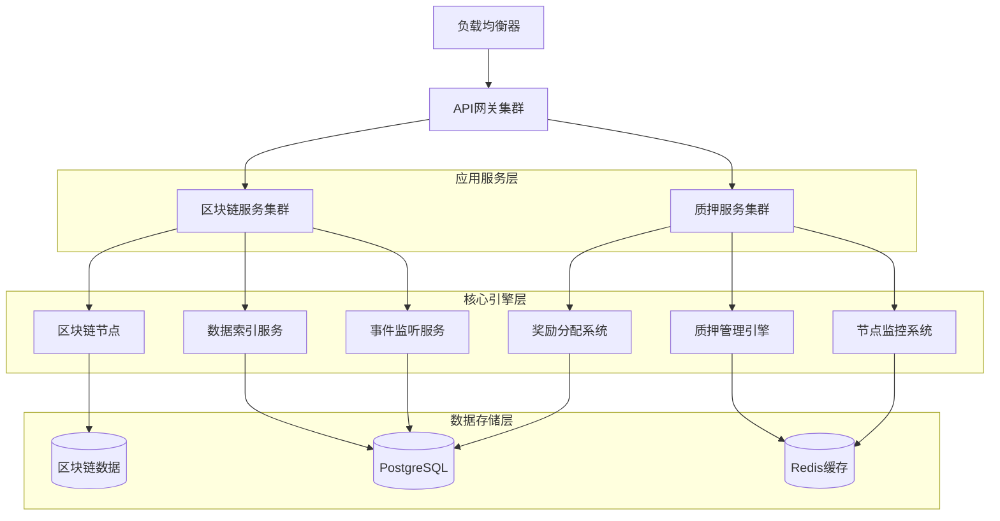
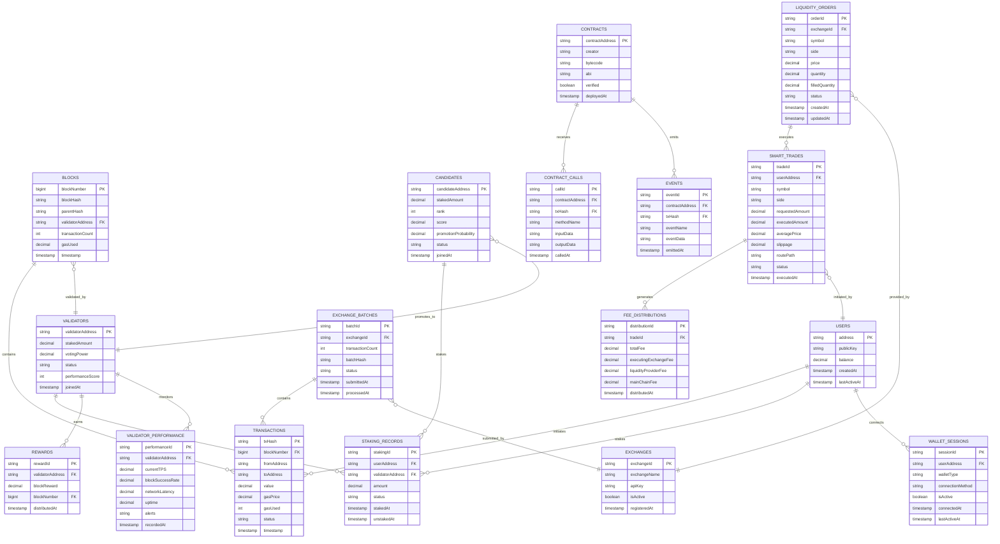
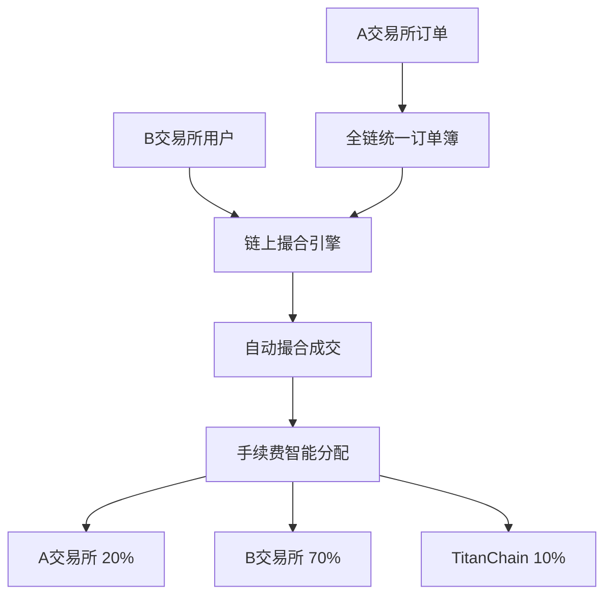

### 4.4 治理API

**获取治理提案**
```
GET /api/v1/governance/proposals
```

**提交投票**
```
POST /api/v1/governance/vote
```

### 4.5 钱包集成API

**钱包连接验证**
```
POST /api/v1/wallet/connect
```

Request:
| 参数名 | 参数类型 | 是否必需 | 描述 |
|--------|----------|----------|------|
| walletType | string | true | 钱包类型 (metamask/walletconnect/coinbase) |
| address | string | true | 钱包地址 |
| signature | string | true | 签名验证 |

**获取钱包资产**
```
GET /api/v1/wallet/:address/assets
```

**批量交易签名**
```
POST /api/v1/wallet/batch-sign
```

### 4.6 候补节点API

**获取候补节点排名**
```
GET /api/v1/candidates/ranking
```

Response:
| 参数名 | 参数类型 | 描述 |
|--------|----------|------|
| candidates | Array | 候补节点列表 |
| rank | number | 排名 |
| address | string | 节点地址 |
| stake | string | 质押数量 |
| score | number | 综合评分 |
| promotionProbability | number | 晋升概率 |

**候补节点质押**
```
POST /api/v1/candidates/stake
```

### 4.7 验证节点管理API

**节点配置检测**
```
GET /api/v1/validators/:address/config-check
```

**节点性能监控**
```
GET /api/v1/validators/:address/performance
```

Response:
| 参数名 | 参数类型 | 描述 |
|--------|----------|------|
| tps | number | 当前TPS |
| blockSuccess | number | 出块成功率 |
| networkLatency | number | 网络延迟 |
| uptime | number | 在线时长 |
| alerts | Array | 告警信息 |

**节点操作控制**
```
POST /api/v1/validators/:address/control
```

Request:
| 参数名 | 参数类型 | 是否必需 | 描述 |
|--------|----------|----------|------|
| action | string | true | 操作类型 (start/stop/restart) |
| signature | string | true | 操作签名 |

### 4.8 交易所集成API

**批量交易上链**
```
POST /api/v1/exchange/batch-transactions
```

Request:
| 参数名 | 参数类型 | 是否必需 | 描述 |
|--------|----------|----------|------|
| exchangeId | string | true | 交易所ID |
| transactions | Array | true | 交易数据批次 |
| signature | string | true | 数据签名 |

**获取交易所数据状态**
```
GET /api/v1/exchange/:exchangeId/status
```

**验证交易数据完整性**
```
POST /api/v1/exchange/verify-data
```

### 4.9 全链统一订单簿撮合API

**获取全链统一订单簿**
```
GET /api/v1/liquidity/unified-orderbook/:symbol
```

Response:
| 参数名 | 参数类型 | 描述 |
|--------|----------|------|
| symbol | string | 交易对符号 |
| unifiedBids | Array | 全网聚合买单深度 |
| unifiedAsks | Array | 全网聚合卖单深度 |
| totalDepth | object | 总深度统计 |
| exchanges | Array | 参与交易所列表 |
| bestPrice | object | 全网最优价格 |
| liquidityScore | number | 流动性评分 |

**链上统一撮合交易**
```
POST /api/v1/liquidity/unified-matching
```

Request:
| 参数名 | 参数类型 | 是否必需 | 描述 |
|--------|----------|----------|------|
| symbol | string | true | 交易对 |
| side | string | true | 买卖方向 (buy/sell) |
| amount | string | true | 交易数量 |
| orderType | string | true | 订单类型 (market/limit) |
| price | string | false | 限价单价格 |
| userAddress | string | true | 用户地址 |

Response:
| 参数名 | 参数类型 | 描述 |
|--------|----------|------|
| matchingResult | object | 撮合结果 |
| executedOrders | Array | 成交订单列表 |
| averagePrice | string | 平均成交价 |
| totalDepthUsed | string | 使用的总深度 |
| feeDistribution | object | 手续费分成 |

**获取撮合引擎统计**
```
GET /api/v1/liquidity/matching-stats
```

Response:
| 参数名 | 参数类型 | 描述 |
|--------|----------|------|
| totalMatches | number | 总撮合次数 |
| averageMatchingTime | number | 平均撮合时间(ms) |
| depthUtilization | number | 深度利用率 |
| liquidityImprovement | number | 流动性提升倍数 |

**获取深度聚合效果**
```
GET /api/v1/liquidity/depth-aggregation/:symbol
```

Response:
| 参数名 | 参数类型 | 描述 |
|--------|----------|------|
| beforeAggregation | object | 聚合前各交易所深度 |
| afterAggregation | object | 聚合后统一深度 |
| improvementRatio | number | 深度提升比例 |
| fragmentationReduction | number | 碎片化减少程度 |

**获取手续费分成统计**
```
GET /api/v1/liquidity/fee-distribution
```

Response:
| 参数名 | 参数类型 | 描述 |
|--------|----------|------|
| totalFees | string | 总手续费 |
| executingExchange | object | 成交交易所分成(70%) |
| liquidityProviders | object | 流动性提供方分成(20%) |
| mainChain | object | 主链分成(10%) |

**注册交易所到统一订单簿**
```
POST /api/v1/liquidity/register-unified-exchange
```

Request:
| 参数名 | 参数类型 | 是否必需 | 描述 |
|--------|----------|----------|------|
| exchangeId | string | true | 交易所ID |
| orderbookEndpoint | string | true | 订单簿API地址 |
| supportedPairs | Array | true | 支持的交易对 |
| syncFrequency | number | true | 同步频率(ms) |
| signature | string | true | 注册签名 |

## 5. 服务器架构图



## 6. 数据模型

### 6.1 数据模型定义



### 6.2 数据定义语言

**用户表 (users)**
```sql
-- 创建用户表
CREATE TABLE users (
    address VARCHAR(42) PRIMARY KEY,
    public_key VARCHAR(130) NOT NULL,
    balance DECIMAL(36,18) DEFAULT 0,
    created_at TIMESTAMP WITH TIME ZONE DEFAULT NOW(),
    last_active_at TIMESTAMP WITH TIME ZONE DEFAULT NOW(),
    CONSTRAINT valid_address CHECK (address ~ '^0x[a-fA-F0-9]{40}$')
);

-- 创建索引
CREATE INDEX idx_block_rewards_validator ON block_rewards(validator_address);
CREATE INDEX idx_block_rewards_block_number ON block_rewards(block_number);
CREATE INDEX idx_block_rewards_distributed_at ON block_rewards(distributed_at DESC);
```

**流动性订单表 (liquidity_orders)**
```sql
-- 创建流动性订单表
CREATE TABLE liquidity_orders (
    order_id UUID PRIMARY KEY DEFAULT gen_random_uuid(),
    exchange_id VARCHAR(50) NOT NULL REFERENCES exchanges(exchange_id),
    symbol VARCHAR(20) NOT NULL,
    side VARCHAR(4) NOT NULL CHECK (side IN ('BUY', 'SELL')),
    price DECIMAL(36,18) NOT NULL CHECK (price > 0),
    quantity DECIMAL(36,18) NOT NULL CHECK (quantity > 0),
    filled_quantity DECIMAL(36,18) DEFAULT 0 CHECK (filled_quantity >= 0),
    status VARCHAR(20) DEFAULT 'ACTIVE' CHECK (status IN ('ACTIVE', 'FILLED', 'CANCELLED', 'EXPIRED')),
    created_at TIMESTAMP WITH TIME ZONE DEFAULT NOW(),
    updated_at TIMESTAMP WITH TIME ZONE DEFAULT NOW()
);

-- 创建索引
CREATE INDEX idx_liquidity_orders_symbol ON liquidity_orders(symbol);
CREATE INDEX idx_liquidity_orders_exchange ON liquidity_orders(exchange_id);
CREATE INDEX idx_liquidity_orders_price ON liquidity_orders(symbol, side, price);
CREATE INDEX idx_liquidity_orders_status ON liquidity_orders(status);
```

**智能交易表 (smart_trades)**
```sql
-- 创建智能交易表
CREATE TABLE smart_trades (
    trade_id UUID PRIMARY KEY DEFAULT gen_random_uuid(),
    user_address VARCHAR(42) NOT NULL REFERENCES users(address),
    symbol VARCHAR(20) NOT NULL,
    side VARCHAR(4) NOT NULL CHECK (side IN ('BUY', 'SELL')),
    requested_amount DECIMAL(36,18) NOT NULL CHECK (requested_amount > 0),
    executed_amount DECIMAL(36,18) DEFAULT 0,
    average_price DECIMAL(36,18) DEFAULT 0,
    slippage DECIMAL(8,6) DEFAULT 0,
    route_path TEXT NOT NULL, -- JSON格式存储执行路径
    status VARCHAR(20) DEFAULT 'PENDING' CHECK (status IN ('PENDING', 'EXECUTING', 'COMPLETED', 'FAILED')),
    executed_at TIMESTAMP WITH TIME ZONE DEFAULT NOW()
);

-- 创建索引
CREATE INDEX idx_smart_trades_user ON smart_trades(user_address);
CREATE INDEX idx_smart_trades_symbol ON smart_trades(symbol);
CREATE INDEX idx_smart_trades_status ON smart_trades(status);
CREATE INDEX idx_smart_trades_executed_at ON smart_trades(executed_at DESC);
```

**手续费分成表 (fee_distributions)**
```sql
-- 创建手续费分成表
CREATE TABLE fee_distributions (
    distribution_id UUID PRIMARY KEY DEFAULT gen_random_uuid(),
    trade_id UUID NOT NULL REFERENCES smart_trades(trade_id),
    total_fee DECIMAL(36,18) NOT NULL CHECK (total_fee >= 0),
    executing_exchange_fee DECIMAL(36,18) NOT NULL, -- 70%
    liquidity_provider_fee DECIMAL(36,18) NOT NULL, -- 20%
    main_chain_fee DECIMAL(36,18) NOT NULL, -- 10%
    executing_exchange_id VARCHAR(50) NOT NULL REFERENCES exchanges(exchange_id),
    liquidity_provider_exchanges TEXT NOT NULL, -- JSON格式存储提供流动性的交易所
    distributed_at TIMESTAMP WITH TIME ZONE DEFAULT NOW()
);

-- 创建索引
CREATE INDEX idx_fee_distributions_trade ON fee_distributions(trade_id);
CREATE INDEX idx_fee_distributions_executing_exchange ON fee_distributions(executing_exchange_id);
CREATE INDEX idx_fee_distributions_distributed_at ON fee_distributions(distributed_at DESC);
```

**初始化数据**
```sql
-- 初始化用户数据
INSERT INTO users (address, public_key, balance) VALUES
('0x0000000000000000000000000000000000000000', '0x0000000000000000000000000000000000000000000000000000000000000000000000000000000000000000000000000000000000000000000000000000000000', 0);

-- 初始化交易所数据
INSERT INTO exchanges (exchange_id, exchange_name, api_key, api_secret_hash) VALUES
('binance', 'Binance', 'binance_api_key', 'hashed_secret'),
('okx', 'OKX', 'okx_api_key', 'hashed_secret'),
('bybit', 'Bybit', 'bybit_api_key', 'hashed_secret');

-- 创建索引
CREATE INDEX idx_users_balance ON users(balance DESC);
CREATE INDEX idx_users_last_active ON users(last_active_at DESC);
```

**区块表 (blocks)**
```sql
-- 创建区块表
CREATE TABLE blocks (
    block_number BIGINT PRIMARY KEY,
    block_hash VARCHAR(66) UNIQUE NOT NULL,
    parent_hash VARCHAR(66) NOT NULL,
    validator_address VARCHAR(42) NOT NULL,
    transaction_count INTEGER DEFAULT 0,
    gas_used DECIMAL(20,0) DEFAULT 0,
    timestamp TIMESTAMP WITH TIME ZONE NOT NULL,
    CONSTRAINT valid_block_hash CHECK (block_hash ~ '^0x[a-fA-F0-9]{64}$')
);

-- 创建索引
CREATE INDEX idx_blocks_validator ON blocks(validator_address);
CREATE INDEX idx_blocks_timestamp ON blocks(timestamp DESC);
```

**交易表 (transactions)**
```sql
-- 创建交易表
CREATE TABLE transactions (
    tx_hash VARCHAR(66) PRIMARY KEY,
    block_number BIGINT NOT NULL REFERENCES blocks(block_number),
    from_address VARCHAR(42) NOT NULL,
    to_address VARCHAR(42),
    value DECIMAL(36,18) DEFAULT 0,
    gas_price DECIMAL(36,18) DEFAULT 0,
    gas_used DECIMAL(20,0) DEFAULT 0,
    status VARCHAR(10) DEFAULT 'SUCCESS' CHECK (status IN ('SUCCESS', 'FAILED', 'PENDING')),
    timestamp TIMESTAMP WITH TIME ZONE NOT NULL,
    CONSTRAINT valid_tx_hash CHECK (tx_hash ~ '^0x[a-fA-F0-9]{64}$')
);

-- 创建索引
CREATE INDEX idx_transactions_from_address ON transactions(from_address);
CREATE INDEX idx_transactions_to_address ON transactions(to_address);
CREATE INDEX idx_transactions_timestamp ON transactions(timestamp DESC);
```

**验证节点表 (validators)**
```sql
-- 创建验证节点表
CREATE TABLE validators (
    validator_address VARCHAR(42) PRIMARY KEY,
    staked_amount DECIMAL(36,18) NOT NULL CHECK (staked_amount >= 100000),
    voting_power DECIMAL(10,6) NOT NULL,
    status VARCHAR(10) DEFAULT 'ACTIVE' CHECK (status IN ('ACTIVE', 'INACTIVE', 'SLASHED')),
    performance_score INTEGER DEFAULT 100 CHECK (performance_score >= 0 AND performance_score <= 100),
    joined_at TIMESTAMP WITH TIME ZONE DEFAULT NOW(),
    last_block_time TIMESTAMP WITH TIME ZONE
);

-- 创建索引
CREATE INDEX idx_validators_staked_amount ON validators(staked_amount DESC);
CREATE INDEX idx_validators_performance ON validators(performance_score DESC);

-- 初始化108个验证节点
INSERT INTO validators (validator_address, staked_amount, voting_power) VALUES
('0x1000000000000000000000000000000000000001', 100000, 0.925926),
('0x1000000000000000000000000000000000000002', 100000, 0.925926),
-- ... 其他106个节点
('0x1000000000000000000000000000000000000108', 100000, 0.925926);
```

**质押记录表 (staking_records)**
```sql
-- 创建质押记录表
CREATE TABLE staking_records (
    staking_id UUID PRIMARY KEY DEFAULT gen_random_uuid(),
    user_address VARCHAR(42) NOT NULL REFERENCES users(address),
    validator_address VARCHAR(42) NOT NULL REFERENCES validators(validator_address),
    amount DECIMAL(36,18) NOT NULL CHECK (amount > 0),
    status VARCHAR(10) DEFAULT 'ACTIVE' CHECK (status IN ('ACTIVE', 'UNSTAKING', 'UNSTAKED')),
    staked_at TIMESTAMP WITH TIME ZONE DEFAULT NOW(),
    unstaked_at TIMESTAMP WITH TIME ZONE
);

-- 创建索引
CREATE INDEX idx_staking_user_address ON staking_records(user_address);
CREATE INDEX idx_staking_validator_address ON staking_records(validator_address);
```

**智能合约表 (contracts)**
```sql
-- 创建智能合约表
CREATE TABLE contracts (
    contract_address VARCHAR(42) PRIMARY KEY,
    creator VARCHAR(42) NOT NULL,
    bytecode TEXT NOT NULL,
    abi TEXT,
    verified BOOLEAN DEFAULT false,
    deployed_at TIMESTAMP WITH TIME ZONE DEFAULT NOW(),
    CONSTRAINT valid_contract_address CHECK (contract_address ~ '^0x[a-fA-F0-9]{40}$')
);

-- 创建索引
CREATE INDEX idx_contracts_creator ON contracts(creator);
CREATE INDEX idx_contracts_deployed_at ON contracts(deployed_at DESC);
```

**钱包会话表 (wallet_sessions)**
```sql
-- 创建钱包会话表
CREATE TABLE wallet_sessions (
    session_id UUID PRIMARY KEY DEFAULT gen_random_uuid(),
    user_address VARCHAR(42) NOT NULL REFERENCES users(address),
    wallet_type VARCHAR(20) NOT NULL CHECK (wallet_type IN ('metamask', 'walletconnect', 'coinbase')),
    connection_method VARCHAR(20) NOT NULL,
    is_active BOOLEAN DEFAULT true,
    connected_at TIMESTAMP WITH TIME ZONE DEFAULT NOW(),
    last_active_at TIMESTAMP WITH TIME ZONE DEFAULT NOW()
);

-- 创建索引
CREATE INDEX idx_wallet_sessions_user ON wallet_sessions(user_address);
CREATE INDEX idx_wallet_sessions_active ON wallet_sessions(is_active, last_active_at);
```

**候补节点表 (candidates)**
```sql
-- 创建候补节点表
CREATE TABLE candidates (
    candidate_address VARCHAR(42) PRIMARY KEY,
    staked_amount DECIMAL(36,18) NOT NULL CHECK (staked_amount >= 10000),
    rank INTEGER NOT NULL,
    score DECIMAL(10,6) NOT NULL DEFAULT 0,
    promotion_probability DECIMAL(5,4) NOT NULL DEFAULT 0,
    status VARCHAR(10) DEFAULT 'ACTIVE' CHECK (status IN ('ACTIVE', 'INACTIVE', 'PROMOTED')),
    joined_at TIMESTAMP WITH TIME ZONE DEFAULT NOW()
);

-- 创建索引
CREATE INDEX idx_candidates_rank ON candidates(rank ASC);
CREATE INDEX idx_candidates_score ON candidates(score DESC);
CREATE INDEX idx_candidates_staked_amount ON candidates(staked_amount DESC);

-- 初始化候补节点排名更新触发器
CREATE OR REPLACE FUNCTION update_candidate_ranking() RETURNS TRIGGER AS $$
BEGIN
    -- 重新计算排名
    WITH ranked_candidates AS (
        SELECT candidate_address, 
               ROW_NUMBER() OVER (ORDER BY score DESC, staked_amount DESC) as new_rank
        FROM candidates 
        WHERE status = 'ACTIVE'
    )
    UPDATE candidates 
    SET rank = ranked_candidates.new_rank
    FROM ranked_candidates 
    WHERE candidates.candidate_address = ranked_candidates.candidate_address;
    
    RETURN NULL;
END;
$$ LANGUAGE plpgsql;

CREATE TRIGGER trigger_update_candidate_ranking
    AFTER INSERT OR UPDATE ON candidates
    FOR EACH STATEMENT EXECUTE FUNCTION update_candidate_ranking();
```

**验证节点性能表 (validator_performance)**
```sql
-- 创建验证节点性能表
CREATE TABLE validator_performance (
    performance_id UUID PRIMARY KEY DEFAULT gen_random_uuid(),
    validator_address VARCHAR(42) NOT NULL REFERENCES validators(validator_address),
    current_tps DECIMAL(10,2) NOT NULL DEFAULT 0,
    block_success_rate DECIMAL(5,4) NOT NULL DEFAULT 1.0,
    network_latency DECIMAL(8,2) NOT NULL DEFAULT 0,
    uptime DECIMAL(5,4) NOT NULL DEFAULT 1.0,
    alerts TEXT,
    recorded_at TIMESTAMP WITH TIME ZONE DEFAULT NOW()
);

-- 创建索引
CREATE INDEX idx_validator_performance_validator ON validator_performance(validator_address);
CREATE INDEX idx_validator_performance_recorded_at ON validator_performance(recorded_at DESC);

-- 创建分区表（按月分区）
CREATE TABLE validator_performance_y2024m01 PARTITION OF validator_performance
    FOR VALUES FROM ('2024-01-01') TO ('2024-02-01');
```

**交易所表 (exchanges)**
```sql
-- 创建交易所表
CREATE TABLE exchanges (
    exchange_id VARCHAR(50) PRIMARY KEY,
    exchange_name VARCHAR(100) NOT NULL,
    api_key VARCHAR(255) NOT NULL,
    api_secret_hash VARCHAR(255) NOT NULL,
    is_active BOOLEAN DEFAULT true,
    daily_transaction_limit INTEGER DEFAULT 1000000,
    registered_at TIMESTAMP WITH TIME ZONE DEFAULT NOW()
);

-- 创建索引
CREATE INDEX idx_exchanges_active ON exchanges(is_active);
```

**交易所批次表 (exchange_batches)**
```sql
-- 创建交易所批次表
CREATE TABLE exchange_batches (
    batch_id UUID PRIMARY KEY DEFAULT gen_random_uuid(),
    exchange_id VARCHAR(50) NOT NULL REFERENCES exchanges(exchange_id),
    transaction_count INTEGER NOT NULL CHECK (transaction_count > 0),
    batch_hash VARCHAR(66) NOT NULL,
    status VARCHAR(20) DEFAULT 'PENDING' CHECK (status IN ('PENDING', 'PROCESSING', 'COMPLETED', 'FAILED')),
    submitted_at TIMESTAMP WITH TIME ZONE DEFAULT NOW(),
    processed_at TIMESTAMP WITH TIME ZONE
);

-- 创建索引
CREATE INDEX idx_exchange_batches_exchange ON exchange_batches(exchange_id);
CREATE INDEX idx_exchange_batches_status ON exchange_batches(status);
CREATE INDEX idx_exchange_batches_submitted_at ON exchange_batches(submitted_at DESC);
```

**区块奖励表 (block_rewards)**
```sql
-- 创建区块奖励表
CREATE TABLE block_rewards (
    reward_id UUID PRIMARY KEY DEFAULT gen_random_uuid(),
    block_number BIGINT NOT NULL REFERENCES blocks(block_number),
    validator_address VARCHAR(42) NOT NULL REFERENCES validators(validator_address),
    base_reward DECIMAL(36,18) NOT NULL,
    stake_weight_reward DECIMAL(36,18) DEFAULT 0,
    performance_weight_reward DECIMAL(36,18) DEFAULT 0,
    governance_weight_reward DECIMAL(36,18) DEFAULT 0,
    total_reward DECIMAL(36,18) NOT NULL,
    distributed_at TIMESTAMP WITH TIME ZONE DEFAULT NOW()
);

-- 创建索引
CREATE INDEX idx_block_rewards_validator ON block_rewards(validator_address);
CREATE INDEX idx_block_rewards_block_number ON block_rewards(block_number);
CREATE INDEX idx_block_rewards_distributed_at ON block_rewards(distributed_at DESC);
```

**TTN代币分配表 (token_allocations)**
```sql
-- 创建TTN代币分配表
CREATE TABLE token_allocations (
    allocation_id UUID PRIMARY KEY DEFAULT gen_random_uuid(),
    allocation_type VARCHAR(20) NOT NULL CHECK (allocation_type IN ('PREMINED', 'BLOCK_REWARD', 'ECOSYSTEM', 'TEAM', 'GOVERNANCE')),
    recipient_address VARCHAR(42) NOT NULL,
    amount DECIMAL(36,18) NOT NULL CHECK (amount > 0),
    vesting_schedule TEXT, -- JSON格式的释放计划
    released_amount DECIMAL(36,18) DEFAULT 0,
    status VARCHAR(10) DEFAULT 'ACTIVE' CHECK (status IN ('ACTIVE', 'COMPLETED', 'CANCELLED')),
    created_at TIMESTAMP WITH TIME ZONE DEFAULT NOW(),
    last_release_at TIMESTAMP WITH TIME ZONE
);

-- 创建索引
CREATE INDEX idx_token_allocations_type ON token_allocations(allocation_type);
CREATE INDEX idx_token_allocations_recipient ON token_allocations(recipient_address);

-- 初始化预挖代币分配
INSERT INTO token_allocations (allocation_type, recipient_address, amount, vesting_schedule) VALUES
('ECOSYSTEM', '0x2000000000000000000000000000000000000001', 500000000, '{"type": "linear", "duration": "4_years", "cliff": "6_months"}'),
('TEAM', '0x2000000000000000000000000000000000000002', 300000000, '{"type": "linear", "duration": "4_years", "cliff": "1_year"}'),
('GOVERNANCE', '0x2000000000000000000000000000000000000003', 200000000, '{"type": "immediate", "governance_controlled": true}');
```

## 7. TTN代币管理系统架构

### 7.1 代币发行智能合约设计

**TTN主合约 (TTNToken.sol)**
```solidity
// SPDX-License-Identifier: MIT
pragma solidity ^0.8.19;

contract TTNToken {
    string public constant name = "TitanChain";
    string public constant symbol = "TTN";
    uint8 public constant decimals = 18;
    
    // 总供应量：20亿TTN
    uint256 public constant TOTAL_SUPPLY = 2_000_000_000 * 10**18;
    
    // 预挖部分：10亿TTN
    uint256 public constant PREMINED_SUPPLY = 1_000_000_000 * 10**18;
    
    // 区块奖励部分：10亿TTN
    uint256 public constant BLOCK_REWARD_SUPPLY = 1_000_000_000 * 10**18;
    
    // 当前已发行的区块奖励
    uint256 public currentBlockRewardSupply = 0;
    
    // 预挖代币分配合约地址
    address public ecosystemFund;    // 5亿TTN
    address public teamFund;         // 3亿TTN  
    address public governanceFund;   // 2亿TTN
    
    // 区块奖励参数
    uint256 public initialBlockReward = 19.03 * 10**18; // 每区块初始奖励
    uint256 public rewardDecayRate = 10; // 每2年递减10%
    uint256 public minBlockReward = 1 * 10**18; // 最小区块奖励
    
    mapping(address => uint256) public balanceOf;
    mapping(address => mapping(address => uint256)) public allowance;
    
    event Transfer(address indexed from, address indexed to, uint256 value);
    event Approval(address indexed owner, address indexed spender, uint256 value);
    event BlockRewardMinted(address indexed validator, uint256 amount, uint256 blockNumber);
    
    constructor(
        address _ecosystemFund,
        address _teamFund, 
        address _governanceFund
    ) {
        ecosystemFund = _ecosystemFund;
        teamFund = _teamFund;
        governanceFund = _governanceFund;
        
        // 预挖代币分配
        balanceOf[ecosystemFund] = 500_000_000 * 10**18;
        balanceOf[teamFund] = 300_000_000 * 10**18;
        balanceOf[governanceFund] = 200_000_000 * 10**18;
        
        emit Transfer(address(0), ecosystemFund, 500_000_000 * 10**18);
        emit Transfer(address(0), teamFund, 300_000_000 * 10**18);
        emit Transfer(address(0), governanceFund, 200_000_000 * 10**18);
    }
    
    // 区块奖励铸造（仅限共识层调用）
    function mintBlockReward(address validator, uint256 blockNumber) external onlyConsensus returns (uint256) {
        require(currentBlockRewardSupply < BLOCK_REWARD_SUPPLY, "Block reward supply exhausted");
        
        uint256 rewardAmount = calculateBlockReward(blockNumber);
        
        if (currentBlockRewardSupply + rewardAmount > BLOCK_REWARD_SUPPLY) {
            rewardAmount = BLOCK_REWARD_SUPPLY - currentBlockRewardSupply;
        }
        
        balanceOf[validator] += rewardAmount;
        currentBlockRewardSupply += rewardAmount;
        
        emit Transfer(address(0), validator, rewardAmount);
        emit BlockRewardMinted(validator, rewardAmount, blockNumber);
        
        return rewardAmount;
    }
    
    // 计算区块奖励
    function calculateBlockReward(uint256 blockNumber) public view returns (uint256) {
        // 每年约525.6万个区块，每2年递减10%
        uint256 yearsPassed = blockNumber / 5_256_000;
        uint256 decayPeriods = yearsPassed / 2;
        
        uint256 currentReward = initialBlockReward;
        for (uint256 i = 0; i < decayPeriods; i++) {
            currentReward = currentReward * 90 / 100; // 递减10%
        }
        
        return currentReward < minBlockReward ? minBlockReward : currentReward;
    }
}
```

**质押管理合约 (StakingManager.sol)**
```solidity
// SPDX-License-Identifier: MIT
pragma solidity ^0.8.19;

contract StakingManager {
    TTNToken public ttnToken;
    
    struct ValidatorInfo {
        uint256 stakedAmount;
        uint256 delegatedAmount;
        uint256 performanceScore;
        bool isActive;
        uint256 joinedAt;
    }
    
    struct StakingInfo {
        uint256 amount;
        uint256 stakedAt;
        uint256 unlockTime;
        bool isValidator;
    }
    
    mapping(address => ValidatorInfo) public validators;
    mapping(address => mapping(address => StakingInfo)) public stakings; // user => validator => staking
    
    uint256 public constant MIN_VALIDATOR_STAKE = 100_000 * 10**18;
    uint256 public constant MIN_DELEGATOR_STAKE = 10_000 * 10**18;
    uint256 public constant VALIDATOR_LOCK_PERIOD = 30 days;
    uint256 public constant DELEGATOR_LOCK_PERIOD = 7 days;
    
    event ValidatorRegistered(address indexed validator, uint256 amount);
    event StakeAdded(address indexed user, address indexed validator, uint256 amount);
    event StakeWithdrawn(address indexed user, address indexed validator, uint256 amount);
    event RewardDistributed(address indexed validator, uint256 amount);
    
    // 注册验证节点
    function registerValidator(uint256 amount) external {
        require(amount >= MIN_VALIDATOR_STAKE, "Insufficient stake for validator");
        require(!validators[msg.sender].isActive, "Already a validator");
        
        ttnToken.transferFrom(msg.sender, address(this), amount);
        
        validators[msg.sender] = ValidatorInfo({
            stakedAmount: amount,
            delegatedAmount: 0,
            performanceScore: 100,
            isActive: true,
            joinedAt: block.timestamp
        });
        
        stakings[msg.sender][msg.sender] = StakingInfo({
            amount: amount,
            stakedAt: block.timestamp,
            unlockTime: block.timestamp + VALIDATOR_LOCK_PERIOD,
            isValidator: true
        });
        
        emit ValidatorRegistered(msg.sender, amount);
    }
    
    // 委托质押
    function delegate(address validator, uint256 amount) external {
        require(validators[validator].isActive, "Validator not active");
        require(amount >= MIN_DELEGATOR_STAKE, "Insufficient delegation amount");
        
        ttnToken.transferFrom(msg.sender, address(this), amount);
        
        validators[validator].delegatedAmount += amount;
        stakings[msg.sender][validator] = StakingInfo({
            amount: amount,
            stakedAt: block.timestamp,
            unlockTime: block.timestamp + DELEGATOR_LOCK_PERIOD,
            isValidator: false
        });
        
        emit StakeAdded(msg.sender, validator, amount);
    }
    
    // 分发区块奖励
    function distributeBlockReward(
        address validator,
        uint256 blockNumber,
        uint256 baseReward,
        uint256 stakeWeight,
        uint256 performanceWeight,
        uint256 governanceWeight
    ) external onlyConsensus {
        require(validators[validator].isActive, "Validator not active");
        
        uint256 totalReward = baseReward + 
                             (baseReward * stakeWeight / 100) + 
                             (baseReward * performanceWeight / 100) + 
                             (baseReward * governanceWeight / 100);
        
        // 铸造奖励代币
        uint256 mintedAmount = ttnToken.mintBlockReward(validator, blockNumber);
        require(mintedAmount >= totalReward, "Insufficient minted amount");
        
        emit RewardDistributed(validator, totalReward);
    }
}
```

**流动性共享智能合约 (LiquiditySharing.sol)**
```solidity
// SPDX-License-Identifier: MIT
pragma solidity ^0.8.19;

contract LiquiditySharing {
    struct Order {
        bytes32 orderId;
        address exchange;
        string symbol;
        bool isBuy;
        uint256 price;
        uint256 quantity;
        uint256 filledQuantity;
        uint256 timestamp;
        bool isActive;
    }
    
    struct Trade {
        bytes32 tradeId;
        address user;
        string symbol;
        bool isBuy;
        uint256 requestedAmount;
        uint256 executedAmount;
        uint256 averagePrice;
        uint256 slippage;
        address[] executingExchanges;
        uint256[] executedAmounts;
        uint256 totalFee;
        uint256 timestamp;
    }
    
    struct FeeDistribution {
        uint256 executingExchangeFee; // 70%
        uint256 liquidityProviderFee; // 20%
        uint256 mainChainFee; // 10%
    }
    
    mapping(bytes32 => Order) public orders;
    mapping(string => bytes32[]) public symbolOrders; // symbol => orderIds
    mapping(bytes32 => Trade) public trades;
    mapping(address => bool) public authorizedExchanges;
    
    // 手续费分成比例
    uint256 public constant EXECUTING_EXCHANGE_FEE_RATE = 70;
    uint256 public constant LIQUIDITY_PROVIDER_FEE_RATE = 20;
    uint256 public constant MAIN_CHAIN_FEE_RATE = 10;
    
    event OrderSubmitted(bytes32 indexed orderId, address indexed exchange, string symbol);
    event OrderFilled(bytes32 indexed orderId, uint256 filledAmount);
    event TradeExecuted(bytes32 indexed tradeId, address indexed user, uint256 executedAmount);
    event FeeDistributed(bytes32 indexed tradeId, uint256 totalFee, address[] exchanges);
    
    modifier onlyAuthorizedExchange() {
        require(authorizedExchanges[msg.sender], "Unauthorized exchange");
        _;
    }
    
    // 提交订单到链上订单簿
    function submitOrder(
        bytes32 orderId,
        string memory symbol,
        bool isBuy,
        uint256 price,
        uint256 quantity
    ) external onlyAuthorizedExchange {
        require(orders[orderId].orderId == bytes32(0), "Order already exists");
        
        orders[orderId] = Order({
            orderId: orderId,
            exchange: msg.sender,
            symbol: symbol,
            isBuy: isBuy,
            price: price,
            quantity: quantity,
            filledQuantity: 0,
            timestamp: block.timestamp,
            isActive: true
        });
        
        symbolOrders[symbol].push(orderId);
        
        emit OrderSubmitted(orderId, msg.sender, symbol);
    }
    
    // 智能路由交易执行
    function executeSmartTrade(
        bytes32 tradeId,
        address user,
        string memory symbol,
        bool isBuy,
        uint256 requestedAmount,
        uint256 maxSlippage
    ) external returns (uint256 executedAmount, uint256 averagePrice) {
        require(trades[tradeId].tradeId == bytes32(0), "Trade already exists");
        
        // 获取最优订单路径
        (bytes32[] memory bestOrders, uint256[] memory amounts) = findOptimalRoute(
            symbol, 
            isBuy, 
            requestedAmount, 
            maxSlippage
        );
        
        uint256 totalExecuted = 0;
        uint256 totalValue = 0;
        address[] memory executingExchanges = new address[](bestOrders.length);
        uint256[] memory executedAmounts = new uint256[](bestOrders.length);
        
        // 执行交易
        for (uint256 i = 0; i < bestOrders.length; i++) {
            Order storage order = orders[bestOrders[i]];
            uint256 executeAmount = amounts[i];
            
            if (executeAmount > 0 && order.isActive) {
                order.filledQuantity += executeAmount;
                if (order.filledQuantity >= order.quantity) {
                    order.isActive = false;
                }
                
                totalExecuted += executeAmount;
                totalValue += executeAmount * order.price;
                executingExchanges[i] = order.exchange;
                executedAmounts[i] = executeAmount;
                
                emit OrderFilled(bestOrders[i], executeAmount);
            }
        }
        
        averagePrice = totalExecuted > 0 ? totalValue / totalExecuted : 0;
        uint256 slippage = calculateSlippage(requestedAmount, totalExecuted, averagePrice);
        
        // 计算手续费
        uint256 totalFee = calculateTradingFee(totalValue);
        
        // 记录交易
        trades[tradeId] = Trade({
            tradeId: tradeId,
            user: user,
            symbol: symbol,
            isBuy: isBuy,
            requestedAmount: requestedAmount,
            executedAmount: totalExecuted,
            averagePrice: averagePrice,
            slippage: slippage,
            executingExchanges: executingExchanges,
            executedAmounts: executedAmounts,
            totalFee: totalFee,
            timestamp: block.timestamp
        });
        
        // 分发手续费
        distributeFees(tradeId, totalFee, executingExchanges);
        
        emit TradeExecuted(tradeId, user, totalExecuted);
        
        return (totalExecuted, averagePrice);
    }
    
    // 寻找最优路由
    function findOptimalRoute(
        string memory symbol,
        bool isBuy,
        uint256 requestedAmount,
        uint256 maxSlippage
    ) internal view returns (bytes32[] memory bestOrders, uint256[] memory amounts) {
        bytes32[] memory availableOrders = symbolOrders[symbol];
        
        // 按价格排序（买单按价格从低到高，卖单按价格从高到低）
        bytes32[] memory sortedOrders = sortOrdersByPrice(availableOrders, isBuy);
        
        uint256 remainingAmount = requestedAmount;
        uint256 orderCount = 0;
        
        // 计算需要的订单数量
        for (uint256 i = 0; i < sortedOrders.length && remainingAmount > 0; i++) {
            Order memory order = orders[sortedOrders[i]];
            if (order.isActive && order.isBuy != isBuy) {
                uint256 availableAmount = order.quantity - order.filledQuantity;
                if (availableAmount > 0) {
                    orderCount++;
                    if (availableAmount >= remainingAmount) {
                        remainingAmount = 0;
                    } else {
                        remainingAmount -= availableAmount;
                    }
                }
            }
        }
        
        bestOrders = new bytes32[](orderCount);
        amounts = new uint256[](orderCount);
        
        remainingAmount = requestedAmount;
        uint256 index = 0;
        
        // 分配执行数量
        for (uint256 i = 0; i < sortedOrders.length && remainingAmount > 0 && index < orderCount; i++) {
            Order memory order = orders[sortedOrders[i]];
            if (order.isActive && order.isBuy != isBuy) {
                uint256 availableAmount = order.quantity - order.filledQuantity;
                if (availableAmount > 0) {
                    bestOrders[index] = sortedOrders[i];
                    if (availableAmount >= remainingAmount) {
                        amounts[index] = remainingAmount;
                        remainingAmount = 0;
                    } else {
                        amounts[index] = availableAmount;
                        remainingAmount -= availableAmount;
                    }
                    index++;
                }
            }
        }
    }
    
    // 按价格排序订单
    function sortOrdersByPrice(bytes32[] memory orderIds, bool isBuy) internal view returns (bytes32[] memory) {
        // 实现快速排序算法
        // 买单：价格从低到高，卖单：价格从高到低
        return orderIds; // 简化实现，实际需要完整的排序算法
    }
    
    // 计算滑点
    function calculateSlippage(uint256 requested, uint256 executed, uint256 avgPrice) internal pure returns (uint256) {
        if (requested == 0) return 0;
        return ((requested - executed) * 10000) / requested; // 基点表示
    }
    
    // 计算交易手续费
    function calculateTradingFee(uint256 tradeValue) internal pure returns (uint256) {
        return tradeValue * 30 / 10000; // 0.3% 手续费
    }
    
    // 分发手续费
    function distributeFees(
        bytes32 tradeId,
        uint256 totalFee,
        address[] memory executingExchanges
    ) internal {
        uint256 executingExchangeFee = totalFee * EXECUTING_EXCHANGE_FEE_RATE / 100;
        uint256 liquidityProviderFee = totalFee * LIQUIDITY_PROVIDER_FEE_RATE / 100;
        uint256 mainChainFee = totalFee * MAIN_CHAIN_FEE_RATE / 100;
        
        // 分发给成交交易所（70%）
        uint256 feePerExchange = executingExchangeFee / executingExchanges.length;
        for (uint256 i = 0; i < executingExchanges.length; i++) {
            if (executingExchanges[i] != address(0)) {
                // 转账给交易所
                payable(executingExchanges[i]).transfer(feePerExchange);
            }
        }
        
        // 分发给流动性提供方（20%）
        // 实际实现中需要根据提供的流动性比例分配
        
        // 主链收取（10%）
        // 转入主链金库
        
        emit FeeDistributed(tradeId, totalFee, executingExchanges);
    }
    
    // 注册授权交易所
    function authorizeExchange(address exchange) external onlyOwner {
        authorizedExchanges[exchange] = true;
    }
    
    // 获取订单簿深度
    function getOrderBookDepth(string memory symbol) external view returns (
        bytes32[] memory buyOrders,
        bytes32[] memory sellOrders,
        uint256[] memory buyPrices,
        uint256[] memory sellPrices,
        uint256[] memory buyQuantities,
        uint256[] memory sellQuantities
    ) {
        bytes32[] memory allOrders = symbolOrders[symbol];
        
        // 分离买单和卖单
        uint256 buyCount = 0;
        uint256 sellCount = 0;
        
        for (uint256 i = 0; i < allOrders.length; i++) {
            Order memory order = orders[allOrders[i]];
            if (order.isActive) {
                if (order.isBuy) {
                    buyCount++;
                } else {
                    sellCount++;
                }
            }
        }
        
        buyOrders = new bytes32[](buyCount);
        sellOrders = new bytes32[](sellCount);
        buyPrices = new uint256[](buyCount);
        sellPrices = new uint256[](sellCount);
        buyQuantities = new uint256[](buyCount);
        sellQuantities = new uint256[](sellCount);
        
        uint256 buyIndex = 0;
        uint256 sellIndex = 0;
        
        for (uint256 i = 0; i < allOrders.length; i++) {
            Order memory order = orders[allOrders[i]];
            if (order.isActive) {
                uint256 availableQuantity = order.quantity - order.filledQuantity;
                if (order.isBuy) {
                    buyOrders[buyIndex] = order.orderId;
                    buyPrices[buyIndex] = order.price;
                    buyQuantities[buyIndex] = availableQuantity;
                    buyIndex++;
                } else {
                    sellOrders[sellIndex] = order.orderId;
                    sellPrices[sellIndex] = order.price;
                    sellQuantities[sellIndex] = availableQuantity;
                    sellIndex++;
                }
            }
        }
    }
}
        uint256 governanceWeight
    ) external onlyConsensus {
        uint256 totalReward = baseReward + 
            (baseReward * stakeWeight / 100) + 
            (baseReward * performanceWeight / 100) + 
            (baseReward * governanceWeight / 100);
            
        ttnToken.mintBlockReward(validator, blockNumber);
        
        emit RewardDistributed(validator, totalReward);
    }
}
```

**候补节点管理合约 (CandidateManager.sol)**
```solidity
// SPDX-License-Identifier: MIT
pragma solidity ^0.8.19;

contract CandidateManager {
    TTNToken public ttnToken;
    StakingManager public stakingManager;
    
    struct CandidateInfo {
        uint256 stakedAmount;
        uint256 score;
        uint256 rank;
        uint256 promotionProbability;
        bool isActive;
        uint256 joinedAt;
    }
    
    mapping(address => CandidateInfo) public candidates;
    address[] public candidateList;
    
    uint256 public constant MIN_CANDIDATE_STAKE = 10_000 * 10**18;
    uint256 public constant MAX_CANDIDATES = 2000;
    uint256 public constant PROMOTION_THRESHOLD = 100; // 前100名有晋升机会
    
    event CandidateRegistered(address indexed candidate, uint256 amount);
    event CandidatePromoted(address indexed candidate, uint256 newRank);
    event ScoreUpdated(address indexed candidate, uint256 newScore);
    
    // 注册候补节点
    function registerCandidate(uint256 amount) external {
        require(amount >= MIN_CANDIDATE_STAKE, "Insufficient stake for candidate");
        require(!candidates[msg.sender].isActive, "Already a candidate");
        require(candidateList.length < MAX_CANDIDATES, "Candidate pool full");
        
        ttnToken.transferFrom(msg.sender, address(this), amount);
        
        candidates[msg.sender] = CandidateInfo({
            stakedAmount: amount,
            score: calculateInitialScore(amount),
            rank: candidateList.length + 1,
            promotionProbability: 0,
            isActive: true,
            joinedAt: block.timestamp
        });
        
        candidateList.push(msg.sender);
        updateRankings();
        
        emit CandidateRegistered(msg.sender, amount);
    }
    
    // 计算初始评分
    function calculateInitialScore(uint256 stakedAmount) internal pure returns (uint256) {
        // 基础分数 + 质押权重
        return 50 + (stakedAmount / 1000 * 10**18); // 每1000 TTN增加1分
    }
    
    // 更新候补节点排名
    function updateRankings() public {
        // 按评分和质押金额排序
        for (uint256 i = 0; i < candidateList.length - 1; i++) {
            for (uint256 j = i + 1; j < candidateList.length; j++) {
                address candidateA = candidateList[i];
                address candidateB = candidateList[j];
                
                if (shouldSwapRanking(candidateA, candidateB)) {
                    candidateList[i] = candidateB;
                    candidateList[j] = candidateA;
                }
            }
        }
        
        // 更新排名和晋升概率
        for (uint256 i = 0; i < candidateList.length; i++) {
            address candidate = candidateList[i];
            candidates[candidate].rank = i + 1;
            candidates[candidate].promotionProbability = calculatePromotionProbability(i + 1);
        }
    }
    
    // 判断是否需要交换排名
    function shouldSwapRanking(address candidateA, address candidateB) internal view returns (bool) {
        CandidateInfo memory infoA = candidates[candidateA];
        CandidateInfo memory infoB = candidates[candidateB];
        
        if (infoA.score != infoB.score) {
            return infoA.score < infoB.score;
        }
        return infoA.stakedAmount < infoB.stakedAmount;
    }
    
    // 计算晋升概率
    function calculatePromotionProbability(uint256 rank) internal pure returns (uint256) {
        if (rank <= 10) return 9500; // 95%
        if (rank <= 50) return 7000; // 70%
        if (rank <= 100) return 3000; // 30%
        return 500; // 5%
    }
    
    // 晋升为验证节点
    function promoteToValidator(address candidate) external onlyGovernance {
        require(candidates[candidate].isActive, "Candidate not active");
        require(candidates[candidate].rank <= PROMOTION_THRESHOLD, "Rank too low for promotion");
        
        uint256 stakedAmount = candidates[candidate].stakedAmount;
        
        // 从候补节点列表中移除
        removeCandidateFromList(candidate);
        candidates[candidate].isActive = false;
        
        // 注册为验证节点
        stakingManager.registerValidator(stakedAmount);
        
        emit CandidatePromoted(candidate, candidates[candidate].rank);
    }
    
    // 从候补节点列表中移除
    function removeCandidateFromList(address candidate) internal {
        for (uint256 i = 0; i < candidateList.length; i++) {
            if (candidateList[i] == candidate) {
                candidateList[i] = candidateList[candidateList.length - 1];
                candidateList.pop();
                break;
            }
        }
        updateRankings();
    }
}
```

**0gas费交易管理合约 (ZeroGasManager.sol)**
```solidity
// SPDX-License-Identifier: MIT
pragma solidity ^0.8.19;

contract ZeroGasManager {
    struct ExchangeInfo {
        string exchangeName;
        bool isActive;
        uint256 dailyLimit;
        uint256 dailyUsed;
        uint256 lastResetTime;
    }
    
    struct BatchTransaction {
        bytes32 batchHash;
        uint256 transactionCount;
        uint256 timestamp;
        bool isProcessed;
    }
    
    mapping(address => ExchangeInfo) public exchanges;
    mapping(bytes32 => BatchTransaction) public batches;
    mapping(address => bool) public authorizedExchanges;
    
    uint256 public constant DEFAULT_DAILY_LIMIT = 1_000_000;
    
    event ExchangeRegistered(address indexed exchange, string name);
    event BatchSubmitted(bytes32 indexed batchHash, address indexed exchange, uint256 count);
    event BatchProcessed(bytes32 indexed batchHash, bool success);
    
    modifier onlyAuthorizedExchange() {
        require(authorizedExchanges[msg.sender], "Not authorized exchange");
        _;
    }
    
    // 注册交易所
    function registerExchange(
        address exchangeAddress,
        string memory exchangeName,
        uint256 dailyLimit
    ) external onlyOwner {
        exchanges[exchangeAddress] = ExchangeInfo({
            exchangeName: exchangeName,
            isActive: true,
            dailyLimit: dailyLimit > 0 ? dailyLimit : DEFAULT_DAILY_LIMIT,
            dailyUsed: 0,
            lastResetTime: block.timestamp
        });
        
        authorizedExchanges[exchangeAddress] = true;
        
        emit ExchangeRegistered(exchangeAddress, exchangeName);
    }
    
    // 提交批量交易
    function submitBatch(
        bytes32 batchHash,
        uint256 transactionCount,
        bytes calldata transactionData
    ) external onlyAuthorizedExchange {
        require(exchanges[msg.sender].isActive, "Exchange not active");
        require(transactionCount > 0, "Invalid transaction count");
        
        // 检查日限额
        resetDailyLimitIfNeeded(msg.sender);
        require(
            exchanges[msg.sender].dailyUsed + transactionCount <= exchanges[msg.sender].dailyLimit,
            "Daily limit exceeded"
        );
        
        // 验证批次数据
        require(validateBatchData(batchHash, transactionData), "Invalid batch data");
        
        batches[batchHash] = BatchTransaction({
            batchHash: batchHash,
            transactionCount: transactionCount,
            timestamp: block.timestamp,
            isProcessed: false
        });
        
        exchanges[msg.sender].dailyUsed += transactionCount;
        
        emit BatchSubmitted(batchHash, msg.sender, transactionCount);
        
        // 异步处理批量交易
        processBatchAsync(batchHash, transactionData);
    }
    
    // 验证批次数据
    function validateBatchData(bytes32 batchHash, bytes calldata data) internal pure returns (bool) {
        return keccak256(data) == batchHash;
    }
    
    // 异步处理批量交易
    function processBatchAsync(bytes32 batchHash, bytes calldata transactionData) internal {
        // 这里实现异步处理逻辑
        // 在实际实现中，这将触发链下处理器
        batches[batchHash].isProcessed = true;
        emit BatchProcessed(batchHash, true);
    }
    
    // 重置日限额
    function resetDailyLimitIfNeeded(address exchange) internal {
        if (block.timestamp >= exchanges[exchange].lastResetTime + 1 days) {
            exchanges[exchange].dailyUsed = 0;
            exchanges[exchange].lastResetTime = block.timestamp;
        }
    }
    
    // 查询批次状态
    function getBatchStatus(bytes32 batchHash) external view returns (
        uint256 transactionCount,
        uint256 timestamp,
        bool isProcessed
    ) {
        BatchTransaction memory batch = batches[batchHash];
        return (batch.transactionCount, batch.timestamp, batch.isProcessed);
    }
}
```

**钱包集成合约 (WalletIntegration.sol)**
```solidity
// SPDX-License-Identifier: MIT
pragma solidity ^0.8.19;

contract WalletIntegration {
    struct WalletSession {
        address userAddress;
        string walletType; // "metamask", "walletconnect", "coinbase"
        uint256 connectedAt;
        bool isActive;
    }
    
    mapping(bytes32 => WalletSession) public sessions;
    mapping(address => bytes32[]) public userSessions;
    
    event WalletConnected(address indexed user, string walletType, bytes32 sessionId);
    event WalletDisconnected(address indexed user, bytes32 sessionId);
    event BatchTransactionSigned(address indexed user, bytes32[] transactionHashes);
    
    // 连接钱包
    function connectWallet(
        address userAddress,
        string memory walletType,
        bytes memory signature
    ) external returns (bytes32 sessionId) {
        // 验证签名
        require(verifyWalletSignature(userAddress, walletType, signature), "Invalid signature");
        
        sessionId = keccak256(abi.encodePacked(userAddress, walletType, block.timestamp));
        
        sessions[sessionId] = WalletSession({
            userAddress: userAddress,
            walletType: walletType,
            connectedAt: block.timestamp,
            isActive: true
        });
        
        userSessions[userAddress].push(sessionId);
        
        emit WalletConnected(userAddress, walletType, sessionId);
    }
    
    // 验证钱包签名
    function verifyWalletSignature(
        address userAddress,
        string memory walletType,
        bytes memory signature
    ) internal pure returns (bool) {
        // 实现EIP-712签名验证
        bytes32 messageHash = keccak256(abi.encodePacked(
            "\x19Ethereum Signed Message:\n32",
            keccak256(abi.encodePacked("TitanChain Wallet Connection:", walletType))
        ));
        
        return recoverSigner(messageHash, signature) == userAddress;
    }
    
    // 恢复签名者地址
    function recoverSigner(bytes32 messageHash, bytes memory signature) internal pure returns (address) {
        require(signature.length == 65, "Invalid signature length");
        
        bytes32 r;
        bytes32 s;
        uint8 v;
        
        assembly {
            r := mload(add(signature, 32))
            s := mload(add(signature, 64))
            v := byte(0, mload(add(signature, 96)))
        }
        
        return ecrecover(messageHash, v, r, s);
    }
    
    // 批量交易签名
    function batchSignTransactions(
        bytes32 sessionId,
        bytes32[] memory transactionHashes,
        bytes[] memory signatures
    ) external {
        require(sessions[sessionId].isActive, "Session not active");
        require(sessions[sessionId].userAddress == msg.sender, "Unauthorized");
        require(transactionHashes.length == signatures.length, "Array length mismatch");
        
        for (uint256 i = 0; i < transactionHashes.length; i++) {
            require(
                verifyTransactionSignature(transactionHashes[i], signatures[i], msg.sender),
                "Invalid transaction signature"
            );
        }
        
        emit BatchTransactionSigned(msg.sender, transactionHashes);
    }
    
    // 验证交易签名
    function verifyTransactionSignature(
        bytes32 transactionHash,
        bytes memory signature,
        address signer
    ) internal pure returns (bool) {
        return recoverSigner(transactionHash, signature) == signer;
    }
    
    // 断开钱包连接
    function disconnectWallet(bytes32 sessionId) external {
        require(sessions[sessionId].userAddress == msg.sender, "Unauthorized");
        
        sessions[sessionId].isActive = false;
        
        emit WalletDisconnected(msg.sender, sessionId);
    }
}
```

### 7.2 代币经济监控系统

**实时监控指标**
- 总供应量和流通量统计
- 预挖代币释放进度
- 区块奖励发放统计
- 验证节点质押分布
- 代币持有者分析
- 通胀率和年化收益率

**风险控制机制**
- 大额转账监控和预警
- 异常质押行为检测
- 验证节点性能监控
- 智能合约安全审计
- 多签钱包管理预挖资金

## 8. 部署架构

### 8.1 容器化部署

**Docker配置**
```dockerfile
# TitanChain节点镜像
FROM ubuntu:22.04

RUN apt-get update && apt-get install -y \
    curl \
    wget \
    git \
    build-essential \
    nodejs \
    npm \
    && rm -rf /var/lib/apt/lists/*

WORKDIR /app
COPY . .

RUN npm install
RUN npm run build

EXPOSE 8545 8546 30303

CMD ["npm", "start"]
```

**Kubernetes部署配置**
```yaml
apiVersion: apps/v1
kind: Deployment
metadata:
  name: titanchain-validator
spec:
  replicas: 3
  selector:
    matchLabels:
      app: titanchain-validator
  template:
    metadata:
      labels:
        app: titanchain-validator
    spec:
      containers:
      - name: validator
        image: titanchain/validator:latest
        ports:
        - containerPort: 8545
        - containerPort: 30303
        env:
        - name: NODE_TYPE
          value: "validator"
        resources:
          requests:
            memory: "4Gi"
            cpu: "2"
          limits:
            memory: "8Gi"
            cpu: "4"
```

### 8.2 监控系统部署

**Prometheus配置**
```yaml
global:
  scrape_interval: 15s

scrape_configs:
  - job_name: 'titanchain-nodes'
    static_configs:
      - targets: ['validator-1:8545', 'validator-2:8545', 'validator-3:8545']
    metrics_path: /metrics
    scrape_interval: 10s

  - job_name: 'titanchain-candidates'
    static_configs:
      - targets: ['candidate-pool:8080']
    metrics_path: /api/metrics

  - job_name: 'exchange-integration'
    static_configs:
      - targets: ['exchange-api:3000']
    metrics_path: /metrics
```

**Grafana仪表板配置**
```json
{
  "dashboard": {
    "title": "TitanChain监控仪表板",
    "panels": [
      {
        "title": "验证节点性能",
        "type": "graph",
        "targets": [
          {
            "expr": "titanchain_validator_tps",
            "legendFormat": "TPS - {{validator}}"
          },
          {
            "expr": "titanchain_validator_block_success_rate",
            "legendFormat": "成功率 - {{validator}}"
          }
        ]
      },
      {
        "title": "候补节点排名",
        "type": "table",
        "targets": [
          {
            "expr": "titanchain_candidate_rank",
            "format": "table"
          }
        ]
      },
      {
        "title": "0gas费交易统计",
        "type": "stat",
        "targets": [
          {
            "expr": "sum(titanchain_zero_gas_transactions_total)",
            "legendFormat": "总交易数"
          }
        ]
      }
    ]
  }
}
```

### 8.3 全链统一订单簿撮合机制详细说明

**核心撮合流程**：
1. **A交易所**：提供流动性订单到全链统一订单簿
2. **B交易所**：用户在此交易所下单并成交
3. **TitanChain**：链上撮合引擎自动匹配A的流动性和B的订单
4. **手续费分成**：A的流动性和B的订单

**技术实现架构**：


**智能合约实现**：
```solidity
// 全链统一撮合的手续费分成逻辑
function distributeCrossExchangeFees(
    uint256 totalFee,
    string memory liquidityExchange,    // A交易所（提供流动）
    string memory executingExchange     // B交易所（用户成交）
) internal {
    uint256 liquidityProviderFee = (totalFee * 2000) / 10000;  // A交易所 20%
    uint256 executingExchangeFee = (totalFee * 7000) / 10000;  // B交易所 70%
    uint256 mainChainFee = (totalFee * 1000) / 10000;          // 主链 10%
    
    // 分配给各方
    transferFee(liquidityExchange, liquidityProviderFee);
    transferFee(executingExchange, executingExchangeFee);
    transferFee("TitanChain", mainChainFee);
}
```

### 8.4 安全配置

**网络安全**
- VPC隔离和安全组配置
- DDoS防护和流量清洗
- SSL/TLS加密通信
- API访问限流和认证

**数据安全**
- 数据库加密存储
- 备份数据异地存储
- 访问日志审计
- 敏感信息脱敏处理

**智能合约安全**
- 多重签名钱包管理
- 合约升级治理机制
- 紧急暂停功能
- 安全审计和漏洞扫描

## 9. 性能优化

### 9.1 区块链性能优化

**共识算法优化**
- 并行验证机制
- 快速最终确认
- 动态验证节点调整
- 网络分片技术

**交易处理优化**
- 批量交易处理
- 交易池优化
- 状态缓存机制
- 并发执行引擎

### 9.2 数据库性能优化

**查询优化**
- 索引策略优化
- 查询缓存机制
- 分区表设计
- 读写分离架构

**存储优化**
- 数据压缩算法
- 冷热数据分离
- 自动清理机制
- 备份策略优化

### 9.3 前端性能优化

**加载优化**
- 代码分割和懒加载
- 静态资源CDN加速
- 图片压缩和优化
- 缓存策略配置

**用户体验优化**
- 钱包连接优化
- 交易状态实时更新
- 错误处理和重试机制
- 响应式设计适配

## 10. 运维监控

### 10.1 系统监控指标

**节点监控**
- CPU、内存、磁盘使用率
- 网络带宽和延迟
- 区块同步状态
- 交易处理性能

**业务监控**
- 验证节点在线率
- 候补节点排名变化
- 0gas费交易成功率
- 钱包连接成功率

### 10.2 告警机制

**关键指标告警**
- 节点离线告警
- 性能异常告警
- 安全事件告警
- 业务异常告警

**告警通知方式**
- 邮件通知
- 短信通知
- 钉钉/企业微信通知
- 监控大屏展示

### 10.3 日志管理

**日志收集**
- 应用日志收集
- 系统日志收集
- 审计日志收集
- 错误日志收集

**日志分析**
- ELK Stack部署
- 日志检索和分析
- 异常模式识别
- 性能瓶颈分析