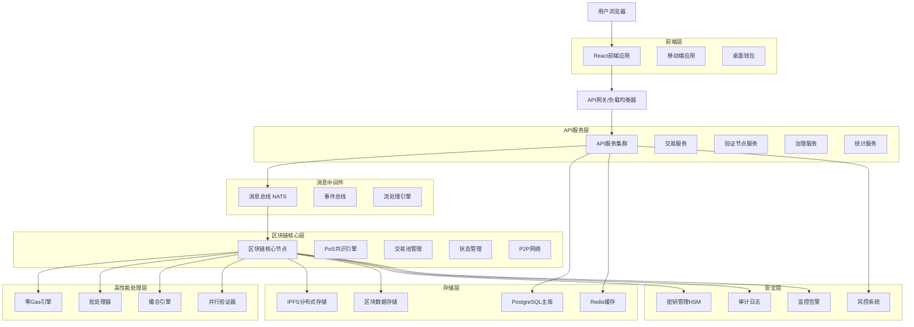
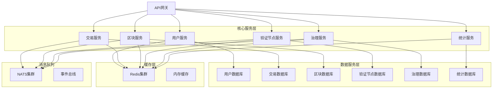
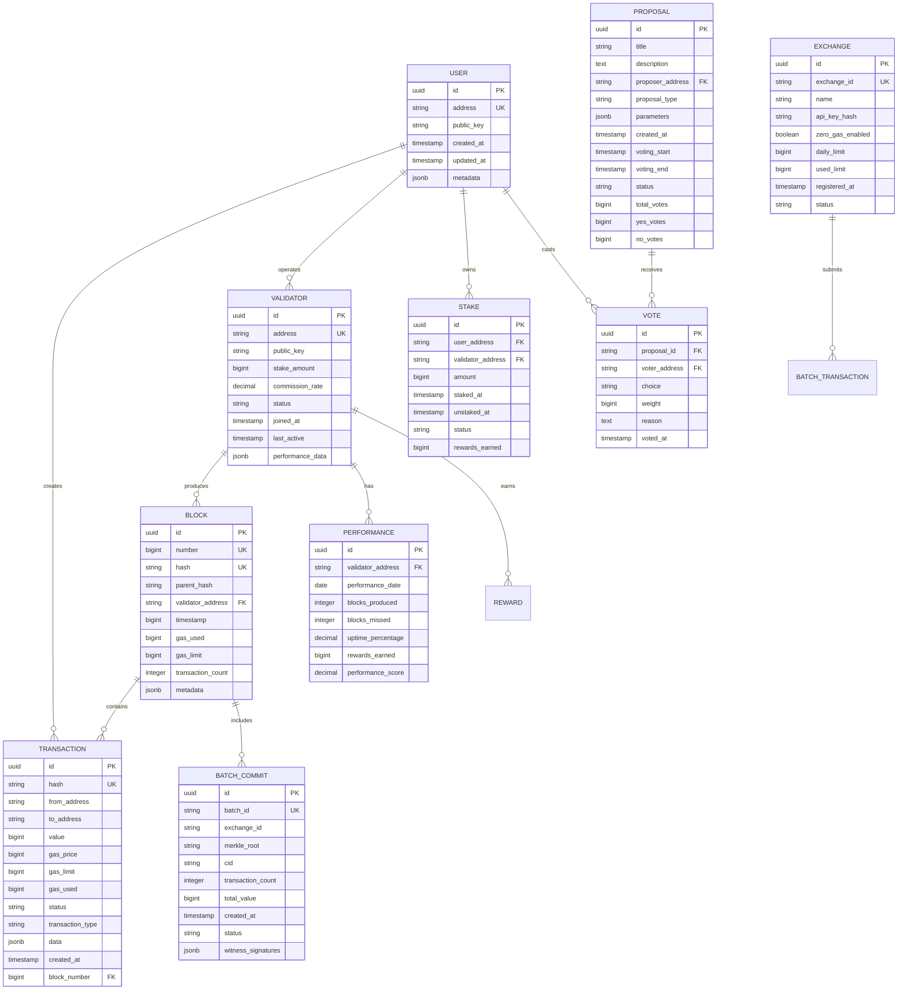

# TitanChain 技术架构文档 - 完整版

## 1. 架构设计

### 1.1 整体架构



### 1.2 分层架构设计

**表示层 (Presentation Layer)**：
- React前端应用：用户界面和交互
- 移动端应用：iOS/Android原生应用
- API网关：统一入口和路由

**业务逻辑层 (Business Logic Layer)**：
- API服务集群：业务逻辑处理
- 消息总线：异步事件处理
- 微服务架构：模块化服务设计

**数据访问层 (Data Access Layer)**：
- 区块链核心：共识和状态管理
- 数据库服务：结构化数据存储
- 缓存服务：高速数据访问

**基础设施层 (Infrastructure Layer)**：
- 容器化部署：Docker + Kubernetes
- 监控系统：Prometheus + Grafana
- 日志系统：ELK Stack

## 2. 技术描述

### 2.1 核心技术栈

**前端技术**：
- React@18 + TypeScript - 现代化前端框架
- Tailwind CSS@3 - 原子化CSS框架  
- Vite@4 - 快速构建工具
- Ethers.js@6 - 区块链交互库
- Wagmi@1 - React区块链Hooks
- Web3Modal@3 - 多钱包连接支持

**后端技术**：
- Node.js@18 + Express@4 - 服务端运行时
- TypeScript@5 - 类型安全开发
- NATS@2 - 高性能消息系统
- Redis@7 - 内存数据库和缓存
- PostgreSQL@15 - 关系型数据库

**区块链技术**：
- 自研PoS共识算法 - 高性能共识机制
- VRF@1.0 - 可验证随机函数
- BLS签名@2.0 - 阈值签名算法
- libp2p@0.45 - P2P网络协议栈

**基础设施**：
- Docker@24 + Kubernetes@1.28 - 容器化部署
- Nginx@1.24 - 负载均衡和反向代理
- IPFS@0.21 - 分布式文件存储
- Prometheus@2.45 + Grafana@10 - 监控系统

### 2.2 性能优化技术

**并发处理**：
- 多线程交易处理
- 异步I/O操作
- 连接池管理
- 批量操作优化

**缓存策略**：
- 多级缓存架构
- 智能缓存预热
- 缓存一致性保证
- 分布式缓存同步

**数据库优化**：
- 读写分离
- 分库分表
- 索引优化
- 查询优化

## 3. 路由定义

### 3.1 前端路由

| 路由 | 页面组件 | 功能描述 |
|------|----------|----------|
| / | HomePage | 首页，显示网络概览和核心统计数据 |
| /wallet | WalletPage | 钱包页面，管理资产和查看交易历史 |
| /send | SendTransactionPage | 发送交易页面，创建和发送交易 |
| /receive | ReceiveTransactionPage | 接收交易页面，生成收款地址和二维码 |
| /validators | ValidatorsPage | 验证节点页面，查看和管理验证节点 |
| /staking | StakingPage | 质押页面，参与网络质押获得收益 |
| /governance | GovernancePage | 治理页面，参与社区治理和投票 |
| /explorer | ExplorerPage | 区块浏览器，查询区块和交易信息 |
| /explorer/block/:height | BlockDetailPage | 区块详情页面，显示特定区块信息 |
| /explorer/tx/:hash | TransactionDetailPage | 交易详情页面，显示交易执行详情 |
| /explorer/address/:address | AddressDetailPage | 地址详情页面，显示地址相关信息 |
| /developers | DevelopersPage | 开发者页面，API文档和开发工具 |
| /developers/api | APIDocumentationPage | API文档页面，详细的接口说明 |
| /developers/sdk | SDKPage | SDK页面，下载和使用指南 |
| /settings | SettingsPage | 设置页面，用户偏好和系统配置 |
| /profile | ProfilePage | 个人资料页面，用户信息管理 |

### 3.2 API路由保护

```typescript
// 路由守卫中间件
interface RouteGuard {
  requireAuth: boolean;
  requireRole?: UserRole[];
  rateLimit?: RateLimitConfig;
}

// 路由配置示例
const routeConfig: Record<string, RouteGuard> = {
  '/api/v1/transactions/submit': {
    requireAuth: true,
    rateLimit: { requests: 100, window: 60000 }
  },
  '/api/v1/validators/register': {
    requireAuth: true,
    requireRole: ['VALIDATOR'],
    rateLimit: { requests: 10, window: 3600000 }
  }
};
```

## 4. API定义

### 4.1 核心API接口

#### 4.1.1 交易相关API

**提交交易**
```
POST /api/v1/transactions/submit
```

请求参数：
| 参数名 | 类型 | 必需 | 描述 |
|--------|------|------|------|
| from | string | true | 发送方地址 |
| to | string | true | 接收方地址 |
| value | string | true | 转账金额 (wei) |
| gasPrice | string | false | Gas价格 |
| gasLimit | string | false | Gas限制 |
| data | string | false | 交易数据 |
| nonce | number | false | 交易序号 |
| signature | object | true | 交易签名 |

响应：
| 参数名 | 类型 | 描述 |
|--------|------|------|
| success | boolean | 请求是否成功 |
| txHash | string | 交易哈希 |
| message | string | 响应消息 |

示例：
```json
{
  "from": "0x742d35Cc6634C0532925a3b8D4C9db96590c6C87",
  "to": "0x8ba1f109551bD432803012645Hac136c22C177ec",
  "value": "1000000000000000000",
  "gasPrice": "20000000000",
  "gasLimit": "21000",
  "signature": {
    "r": "0x...",
    "s": "0x...", 
    "v": 27
  }
}
```

**查询交易**
```
GET /api/v1/transactions/{hash}
```

响应：
```json
{
  "hash": "0x...",
  "from": "0x...",
  "to": "0x...",
  "value": "1000000000000000000",
  "gasUsed": "21000",
  "status": "success",
  "blockNumber": 12345,
  "timestamp": 1640995200
}
```

#### 4.1.2 区块相关API

**获取最新区块**
```
GET /api/v1/blocks/latest
```

**按高度获取区块**
```
GET /api/v1/blocks/{height}
```

**按哈希获取区块**
```
GET /api/v1/blocks/hash/{hash}
```

响应示例：
```json
{
  "number": 12345,
  "hash": "0x...",
  "parentHash": "0x...",
  "timestamp": 1640995200,
  "validator": "0x...",
  "transactionCount": 150,
  "transactions": ["0x...", "0x..."],
  "gasUsed": "3000000",
  "gasLimit": "10000000"
}
```

#### 4.1.3 验证节点相关API

**获取验证节点列表**
```
GET /api/v1/validators
```

查询参数：
| 参数名 | 类型 | 必需 | 描述 |
|--------|------|------|------|
| status | string | false | 节点状态筛选 |
| page | number | false | 页码 |
| limit | number | false | 每页数量 |

**注册验证节点**
```
POST /api/v1/validators/register
```

请求参数：
| 参数名 | 类型 | 必需 | 描述 |
|--------|------|------|------|
| address | string | true | 验证节点地址 |
| publicKey | string | true | 公钥 |
| stake | string | true | 质押金额 |
| commission | number | true | 佣金比例 |
| metadata | object | false | 节点元数据 |

**获取节点性能**
```
GET /api/v1/validators/{address}/performance
```

响应：
```json
{
  "address": "0x...",
  "uptime": 0.995,
  "blocksProduced": 1250,
  "missedBlocks": 5,
  "slashingEvents": 0,
  "totalRewards": "50000000000000000000",
  "performance": {
    "score": 0.98,
    "rank": 15,
    "trend": "stable"
  }
}
```

#### 4.1.4 治理相关API

**获取提案列表**
```
GET /api/v1/governance/proposals
```

**创建提案**
```
POST /api/v1/governance/proposals
```

**投票**
```
POST /api/v1/governance/proposals/{id}/vote
```

请求参数：
| 参数名 | 类型 | 必需 | 描述 |
|--------|------|------|------|
| choice | string | true | 投票选择 (yes/no/abstain) |
| weight | string | false | 投票权重 |
| reason | string | false | 投票理由 |

#### 4.1.5 统计相关API

**网络统计**
```
GET /api/v1/stats/network
```

响应：
```json
{
  "currentTPS": 85000,
  "peakTPS": 180000,
  "totalTransactions": "1250000000",
  "activeValidators": 108,
  "totalStaked": "500000000000000000000000",
  "networkHashRate": "15.5 TH/s",
  "averageBlockTime": 1.2
}
```

**性能统计**
```
GET /api/v1/stats/performance
```

**验证节点统计**
```
GET /api/v1/stats/validators
```

### 4.2 WebSocket事件API

**连接端点**：
```
wss://api.titanchain.io/ws
```

**订阅事件**：
```json
{
  "action": "subscribe",
  "topics": ["new_blocks", "new_transactions", "validator_updates"]
}
```

**事件格式**：

新区块事件：
```json
{
  "type": "new_block",
  "data": {
    "height": 12345,
    "hash": "0x...",
    "timestamp": 1640995200,
    "transactionCount": 150,
    "validator": "0x..."
  }
}
```

交易确认事件：
```json
{
  "type": "transaction_confirmed",
  "data": {
    "hash": "0x...",
    "status": "success",
    "blockHeight": 12345,
    "gasUsed": "21000"
  }
}
```

验证节点更新事件：
```json
{
  "type": "validator_update",
  "data": {
    "address": "0x...",
    "status": "active",
    "performance": 0.98,
    "stake": "1000000000000000000000"
  }
}
```

### 4.3 批量操作API

**批量交易提交**
```
POST /api/v1/transactions/batch
```

请求：
```json
{
  "transactions": [
    {
      "from": "0x...",
      "to": "0x...",
      "value": "1000000000000000000",
      "signature": {...}
    }
  ],
  "batchType": "zero_gas",
  "exchangeId": "binance"
}
```

**批量查询**
```
POST /api/v1/query/batch
```

### 4.4 错误处理

**标准错误响应**：
```json
{
  "success": false,
  "error": {
    "code": "INVALID_TRANSACTION",
    "message": "Transaction signature is invalid",
    "details": {
      "field": "signature",
      "reason": "Invalid signature format"
    }
  },
  "timestamp": 1640995200
}
```

**错误代码定义**：
- `INVALID_TRANSACTION`: 无效交易
- `INSUFFICIENT_BALANCE`: 余额不足
- `RATE_LIMIT_EXCEEDED`: 超出限流
- `VALIDATOR_NOT_FOUND`: 验证节点不存在
- `PROPOSAL_NOT_FOUND`: 提案不存在
- `UNAUTHORIZED`: 未授权访问
- `INTERNAL_ERROR`: 内部服务器错误

## 5. 服务器架构图

### 5.1 微服务架构



### 5.2 服务间通信

**同步通信**：
- HTTP/HTTPS RESTful API
- gRPC高性能RPC调用
- GraphQL统一查询接口

**异步通信**：
- NATS消息队列
- 事件驱动架构
- 发布订阅模式

**服务发现**：
- Consul服务注册中心
- 健康检查机制
- 负载均衡策略

### 5.3 部署架构

**容器化部署**：
```yaml
# docker-compose.yml
version: '3.8'
services:
  api-gateway:
    image: titanchain/api-gateway:latest
    ports:
      - "80:80"
      - "443:443"
    environment:
      - UPSTREAM_SERVERS=api1:3000,api2:3000,api3:3000
    
  api-server:
    image: titanchain/api-server:latest
    replicas: 3
    environment:
      - DATABASE_URL=postgresql://user:pass@db:5432/titanchain
      - REDIS_URL=redis://redis:6379
      - NATS_URL=nats://nats:4222
    
  blockchain-node:
    image: titanchain/blockchain-node:latest
    volumes:
      - blockchain-data:/data
    environment:
      - NODE_TYPE=validator
      - P2P_PORT=30303
      - RPC_PORT=8545
    
  database:
    image: postgres:15
    environment:
      - POSTGRES_DB=titanchain
      - POSTGRES_USER=user
      - POSTGRES_PASSWORD=pass
    volumes:
      - postgres-data:/var/lib/postgresql/data
    
  redis:
    image: redis:7-alpine
    volumes:
      - redis-data:/data
    
  nats:
    image: nats:2.9-alpine
    ports:
      - "4222:4222"
      - "8222:8222"
```

**Kubernetes部署**：
```yaml
# k8s-deployment.yml
apiVersion: apps/v1
kind: Deployment
metadata:
  name: titanchain-api
spec:
  replicas: 3
  selector:
    matchLabels:
      app: titanchain-api
  template:
    metadata:
      labels:
        app: titanchain-api
    spec:
      containers:
      - name: api-server
        image: titanchain/api-server:latest
        ports:
        - containerPort: 3000
        env:
        - name: DATABASE_URL
          valueFrom:
            secretKeyRef:
              name: titanchain-secrets
              key: database-url
        resources:
          requests:
            memory: "512Mi"
            cpu: "500m"
          limits:
            memory: "1Gi"
            cpu: "1000m"
---
apiVersion: v1
kind: Service
metadata:
  name: titanchain-api-service
spec:
  selector:
    app: titanchain-api
  ports:
  - protocol: TCP
    port: 80
    targetPort: 3000
  type: LoadBalancer
```

## 6. 数据模型

### 6.1 数据模型定义



### 6.2 数据定义语言 (DDL)

#### 用户表 (users)
```sql
-- 创建用户表
CREATE TABLE users (
    id UUID PRIMARY KEY DEFAULT gen_random_uuid(),
    address VARCHAR(42) UNIQUE NOT NULL,
    public_key VARCHAR(130),
    created_at TIMESTAMP WITH TIME ZONE DEFAULT NOW(),
    updated_at TIMESTAMP WITH TIME ZONE DEFAULT NOW(),
    metadata JSONB DEFAULT '{}'::jsonb
);

-- 创建索引
CREATE INDEX idx_users_address ON users(address);
CREATE INDEX idx_users_created_at ON users(created_at DESC);

-- 初始化数据
INSERT INTO users (address, public_key, metadata) VALUES
('0x742d35Cc6634C0532925a3b8D4C9db96590c6C87', '0x04...', '{"role": "admin", "verified": true}'),
('0x8ba1f109551bD432803012645Hac136c22C177ec', '0x04...', '{"role": "user", "verified": false}');
```

#### 验证节点表 (validators)
```sql
-- 创建验证节点表
CREATE TABLE validators (
    id UUID PRIMARY KEY DEFAULT gen_random_uuid(),
    address VARCHAR(42) UNIQUE NOT NULL,
    public_key VARCHAR(130) NOT NULL,
    stake_amount BIGINT NOT NULL DEFAULT 0,
    commission_rate DECIMAL(5,4) NOT NULL DEFAULT 0.1000,
    status VARCHAR(20) NOT NULL DEFAULT 'inactive' CHECK (status IN ('active', 'inactive', 'jailed', 'slashed')),
    joined_at TIMESTAMP WITH TIME ZONE DEFAULT NOW(),
    last_active TIMESTAMP WITH TIME ZONE DEFAULT NOW(),
    performance_data JSONB DEFAULT '{}'::jsonb
);

-- 创建索引
CREATE INDEX idx_validators_address ON validators(address);
CREATE INDEX idx_validators_status ON validators(status);
CREATE INDEX idx_validators_stake_amount ON validators(stake_amount DESC);
CREATE INDEX idx_validators_last_active ON validators(last_active DESC);

-- 初始化验证节点数据
INSERT INTO validators (address, public_key, stake_amount, commission_rate, status) VALUES
('0x1234567890123456789012345678901234567890', '0x04...', 1000000000000000000000, 0.0500, 'active'),
('0x2345678901234567890123456789012345678901', '0x04...', 2000000000000000000000, 0.0750, 'active'),
('0x3456789012345678901234567890123456789012', '0x04...', 1500000000000000000000, 0.1000, 'inactive');
```

#### 交易表 (transactions)
```sql
-- 创建交易表
CREATE TABLE transactions (
    id UUID PRIMARY KEY DEFAULT gen_random_uuid(),
    hash VARCHAR(66) UNIQUE NOT NULL,
    from_address VARCHAR(42) NOT NULL,
    to_address VARCHAR(42),
    value BIGINT NOT NULL DEFAULT 0,
    gas_price BIGINT NOT NULL DEFAULT 0,
    gas_limit BIGINT NOT NULL DEFAULT 21000,
    gas_used BIGINT DEFAULT 0,
    status VARCHAR(20) NOT NULL DEFAULT 'pending' CHECK (status IN ('pending', 'success', 'failed')),
    transaction_type VARCHAR(30) NOT NULL DEFAULT 'transfer' CHECK (transaction_type IN ('transfer', 'contract_call', 'zero_gas', 'batch')),
    data TEXT DEFAULT '',
    created_at TIMESTAMP WITH TIME ZONE DEFAULT NOW(),
    block_number BIGINT,
    nonce BIGINT NOT NULL
);

-- 创建索引
CREATE INDEX idx_transactions_hash ON transactions(hash);
CREATE INDEX idx_transactions_from_address ON transactions(from_address);
CREATE INDEX idx_transactions_to_address ON transactions(to_address);
CREATE INDEX idx_transactions_block_number ON transactions(block_number);
CREATE INDEX idx_transactions_created_at ON transactions(created_at DESC);
CREATE INDEX idx_transactions_status ON transactions(status);
CREATE INDEX idx_transactions_type ON transactions(transaction_type);

-- 分区表（按月分区）
CREATE TABLE transactions_y2024m01 PARTITION OF transactions
FOR VALUES FROM ('2024-01-01') TO ('2024-02-01');

CREATE TABLE transactions_y2024m02 PARTITION OF transactions  
FOR VALUES FROM ('2024-02-01') TO ('2024-03-01');
```

#### 区块表 (blocks)
```sql
-- 创建区块表
CREATE TABLE blocks (
    id UUID PRIMARY KEY DEFAULT gen_random_uuid(),
    number BIGINT UNIQUE NOT NULL,
    hash VARCHAR(66) UNIQUE NOT NULL,
    parent_hash VARCHAR(66) NOT NULL,
    validator_address VARCHAR(42) NOT NULL,
    timestamp BIGINT NOT NULL,
    gas_used BIGINT NOT NULL DEFAULT 0,
    gas_limit BIGINT NOT NULL DEFAULT 10000000,
    transaction_count INTEGER NOT NULL DEFAULT 0,
    metadata JSONB DEFAULT '{}'::jsonb,
    created_at TIMESTAMP WITH TIME ZONE DEFAULT NOW()
);

-- 创建索引
CREATE INDEX idx_blocks_number ON blocks(number DESC);
CREATE INDEX idx_blocks_hash ON blocks(hash);
CREATE INDEX idx_blocks_validator ON blocks(validator_address);
CREATE INDEX idx_blocks_timestamp ON blocks(timestamp DESC);

-- 初始化创世区块
INSERT INTO blocks (number, hash, parent_hash, validator_address, timestamp, gas_used, gas_limit, transaction_count) VALUES
(0, '0x0000000000000000000000000000000000000000000000000000000000000000', '0x0000000000000000000000000000000000000000000000000000000000000000', '0x0000000000000000000000000000000000000000', 1640995200, 0, 10000000, 0);
```

#### 质押表 (stakes)
```sql
-- 创建质押表
CREATE TABLE stakes (
    id UUID PRIMARY KEY DEFAULT gen_random_uuid(),
    user_address VARCHAR(42) NOT NULL,
    validator_address VARCHAR(42) NOT NULL,
    amount BIGINT NOT NULL,
    staked_at TIMESTAMP WITH TIME ZONE DEFAULT NOW(),
    unstaked_at TIMESTAMP WITH TIME ZONE,
    status VARCHAR(20) NOT NULL DEFAULT 'active' CHECK (status IN ('active', 'unstaking', 'unstaked')),
    rewards_earned BIGINT NOT NULL DEFAULT 0,
    UNIQUE(user_address, validator_address, staked_at)
);

-- 创建索引
CREATE INDEX idx_stakes_user_address ON stakes(user_address);
CREATE INDEX idx_stakes_validator_address ON stakes(validator_address);
CREATE INDEX idx_stakes_status ON stakes(status);
CREATE INDEX idx_stakes_staked_at ON stakes(staked_at DESC);
```

#### 治理提案表 (proposals)
```sql
-- 创建提案表
CREATE TABLE proposals (
    id UUID PRIMARY KEY DEFAULT gen_random_uuid(),
    title VARCHAR(200) NOT NULL,
    description TEXT NOT NULL,
    proposer_address VARCHAR(42) NOT NULL,
    proposal_type VARCHAR(30) NOT NULL CHECK (proposal_type IN ('parameter_change', 'software_upgrade', 'text_proposal')),
    parameters JSONB DEFAULT '{}'::jsonb,
    created_at TIMESTAMP WITH TIME ZONE DEFAULT NOW(),
    voting_start TIMESTAMP WITH TIME ZONE NOT NULL,
    voting_end TIMESTAMP WITH TIME ZONE NOT NULL,
    status VARCHAR(20) NOT NULL DEFAULT 'active' CHECK (status IN ('active', 'passed', 'rejected', 'expired')),
    total_votes BIGINT NOT NULL DEFAULT 0,
    yes_votes BIGINT NOT NULL DEFAULT 0,
    no_votes BIGINT NOT NULL DEFAULT 0,
    abstain_votes BIGINT NOT NULL DEFAULT 0
);

-- 创建索引
CREATE INDEX idx_proposals_status ON proposals(status);
CREATE INDEX idx_proposals_voting_end ON proposals(voting_end);
CREATE INDEX idx_proposals_proposer ON proposals(proposer_address);
```

#### 投票表 (votes)
```sql
-- 创建投票表
CREATE TABLE votes (
    id UUID PRIMARY KEY DEFAULT gen_random_uuid(),
    proposal_id UUID NOT NULL REFERENCES proposals(id),
    voter_address VARCHAR(42) NOT NULL,
    choice VARCHAR(10) NOT NULL CHECK (choice IN ('yes', 'no', 'abstain')),
    weight BIGINT NOT NULL,
    reason TEXT,
    voted_at TIMESTAMP WITH TIME ZONE DEFAULT NOW(),
    UNIQUE(proposal_id, voter_address)
);

-- 创建索引
CREATE INDEX idx_votes_proposal_id ON votes(proposal_id);
CREATE INDEX idx_votes_voter_address ON votes(voter_address);
CREATE INDEX idx_votes_choice ON votes(choice);
```

#### 性能统计表 (performance)
```sql
-- 创建性能统计表
CREATE TABLE performance (
    id UUID PRIMARY KEY DEFAULT gen_random_uuid(),
    validator_address VARCHAR(42) NOT NULL,
    performance_date DATE NOT NULL,
    blocks_produced INTEGER NOT NULL DEFAULT 0,
    blocks_missed INTEGER NOT NULL DEFAULT 0,
    uptime_percentage DECIMAL(5,4) NOT NULL DEFAULT 0.0000,
    rewards_earned BIGINT NOT NULL DEFAULT 0,
    performance_score DECIMAL(5,4) NOT NULL DEFAULT 0.0000,
    created_at TIMESTAMP WITH TIME ZONE DEFAULT NOW(),
    UNIQUE(validator_address, performance_date)
);

-- 创建索引
CREATE INDEX idx_performance_validator ON performance(validator_address);
CREATE INDEX idx_performance_date ON performance(performance_date DESC);
CREATE INDEX idx_performance_score ON performance(performance_score DESC);
```

#### 批次承诺表 (batch_commits)
```sql
-- 创建批次承诺表
CREATE TABLE batch_commits (
    id UUID PRIMARY KEY DEFAULT gen_random_uuid(),
    batch_id VARCHAR(66) UNIQUE NOT NULL,
    exchange_id VARCHAR(50) NOT NULL,
    merkle_root VARCHAR(66) NOT NULL,
    cid VARCHAR(100) NOT NULL,
    transaction_count INTEGER NOT NULL DEFAULT 0,
    total_value BIGINT NOT NULL DEFAULT 0,
    created_at TIMESTAMP WITH TIME ZONE DEFAULT NOW(),
    status VARCHAR(20) NOT NULL DEFAULT 'pending' CHECK (status IN ('pending', 'confirmed', 'challenged', 'finalized')),
    witness_signatures JSONB DEFAULT '[]'::jsonb
);

-- 创建索引
CREATE INDEX idx_batch_commits_batch_id ON batch_commits(batch_id);
CREATE INDEX idx_batch_commits_exchange_id ON batch_commits(exchange_id);
CREATE INDEX idx_batch_commits_status ON batch_commits(status);
CREATE INDEX idx_batch_commits_created_at ON batch_commits(created_at DESC);
```

#### 交易所表 (exchanges)
```sql
-- 创建交易所表
CREATE TABLE exchanges (
    id UUID PRIMARY KEY DEFAULT gen_random_uuid(),
    exchange_id VARCHAR(50) UNIQUE NOT NULL,
    name VARCHAR(100) NOT NULL,
    api_key_hash VARCHAR(64) NOT NULL,
    zero_gas_enabled BOOLEAN NOT NULL DEFAULT false,
    daily_limit BIGINT NOT NULL DEFAULT 1000000,
    used_limit BIGINT NOT NULL DEFAULT 0,
    registered_at TIMESTAMP WITH TIME ZONE DEFAULT NOW(),
    status VARCHAR(20) NOT NULL DEFAULT 'active' CHECK (status IN ('active', 'suspended', 'banned'))
);

-- 创建索引
CREATE INDEX idx_exchanges_exchange_id ON exchanges(exchange_id);
CREATE INDEX idx_exchanges_status ON exchanges(status);

-- 初始化交易所数据
INSERT INTO exchanges (exchange_id, name, api_key_hash, zero_gas_enabled, daily_limit) VALUES
('binance', 'Binance', 'hash_of_api_key_1', true, 10000000),
('coinbase', 'Coinbase', 'hash_of_api_key_2', true, 5000000),
('okx', 'OKX', 'hash_of_api_key_3', false, 1000000);
```

### 6.3 数据库优化策略

#### 分区策略
```sql
-- 按时间分区交易表
CREATE TABLE transactions (
    -- 列定义...
) PARTITION BY RANGE (created_at);

-- 创建月度分区
CREATE TABLE transactions_y2024m01 PARTITION OF transactions
FOR VALUES FROM ('2024-01-01') TO ('2024-02-01');

-- 自动分区管理
CREATE OR REPLACE FUNCTION create_monthly_partition()
RETURNS void AS $$
DECLARE
    start_date date;
    end_date date;
    table_name text;
BEGIN
    start_date := date_trunc('month', CURRENT_DATE + interval '1 month');
    end_date := start_date + interval '1 month';
    table_name := 'transactions_y' || to_char(start_date, 'YYYY') || 'm' || to_char(start_date, 'MM');
    
    EXECUTE format('CREATE TABLE %I PARTITION OF transactions FOR VALUES FROM (%L) TO (%L)',
                   table_name, start_date, end_date);
END;
$$ LANGUAGE plpgsql;
```

#### 索引优化
```sql
-- 复合索引优化查询
CREATE INDEX idx_transactions_from_status_created ON transactions(from_address, status, created_at DESC);
CREATE INDEX idx_blocks_validator_timestamp ON blocks(validator_address, timestamp DESC);

-- 部分索引减少存储空间
CREATE INDEX idx_transactions_pending ON transactions(created_at) WHERE status = 'pending';
CREATE INDEX idx_validators_active ON validators(stake_amount DESC) WHERE status = 'active';

-- 表达式索引
CREATE INDEX idx_users_address_lower ON users(lower(address));
```

#### 查询优化
```sql
-- 使用物化视图预计算统计数据
CREATE MATERIALIZED VIEW validator_stats AS
SELECT 
    v.address,
    v.stake_amount,
    COUNT(b.id) as blocks_produced,
    AVG(p.performance_score) as avg_performance,
    SUM(p.rewards_earned) as total_rewards
FROM validators v
LEFT JOIN blocks b ON v.address = b.validator_address
LEFT JOIN performance p ON v.address = p.validator_address
WHERE v.status = 'active'
GROUP BY v.address, v.stake_amount;

-- 创建唯一索引
CREATE UNIQUE INDEX idx_validator_stats_address ON validator_stats(address);

-- 定期刷新物化视图
CREATE OR REPLACE FUNCTION refresh_validator_stats()
RETURNS void AS $$
BEGIN
    REFRESH MATERIALIZED VIEW CONCURRENTLY validator_stats;
END;
$$ LANGUAGE plpgsql;
```

## 7. 监控和运维

### 7.1 监控指标

**系统指标**：
- CPU使用率、内存使用率
- 磁盘I/O、网络I/O
- 数据库连接数、查询性能
- 缓存命中率、队列长度

**业务指标**：
- TPS、延迟分布
- 交易成功率、错误率
- 验证节点在线率
- 网络参与度

**告警规则**：
```yaml
# prometheus-rules.yml
groups:
- name: titanchain.rules
  rules:
  - alert: HighTPS
    expr: titanchain_tps > 180000
    for: 5m
    labels:
      severity: warning
    annotations:
      summary: "TPS approaching limit"
      
  - alert: ValidatorOffline
    expr: titanchain_validator_online_count < 100
    for: 2m
    labels:
      severity: critical
    annotations:
      summary: "Validator count below threshold"
```

### 7.2 日志管理

**日志格式**：
```json
{
  "timestamp": "2024-01-01T12:00:00Z",
  "level": "INFO",
  "service": "api-server",
  "module": "transaction",
  "message": "Transaction submitted successfully",
  "metadata": {
    "txHash": "0x...",
    "from": "0x...",
    "to": "0x...",
    "value": "1000000000000000000"
  },
  "traceId": "abc123",
  "spanId": "def456"
}
```

**日志收集**：
- Filebeat收集日志文件
- Logstash处理和转换
- Elasticsearch存储和索引
- Kibana可视化和查询

### 7.3 备份和恢复

**数据备份策略**：
- 数据库每日全量备份
- 交易日志实时备份
- 区块数据分布式存储
- 配置文件版本控制

**灾难恢复**：
- 多地域部署
- 自动故障转移
- 数据一致性检查
- 恢复时间目标 < 1小时

## 总结

TitanChain技术架构采用现代化的微服务架构设计，通过分层设计、模块化开发和容器化部署，实现了高性能、高可用和高扩展性的区块链基础设施。

核心技术特点：
- **高性能**: 200k TPS吞吐量，<100ms延迟
- **高可用**: 99.9%系统可用性，自动故障恢复
- **高扩展**: 水平扩展支持，弹性资源调度
- **高安全**: 多层安全防护，全面审计机制

通过完善的API设计、数据模型和监控体系，为开发者和用户提供稳定可靠的区块链服务平台。