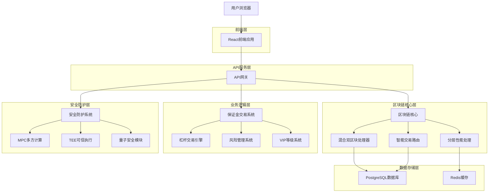
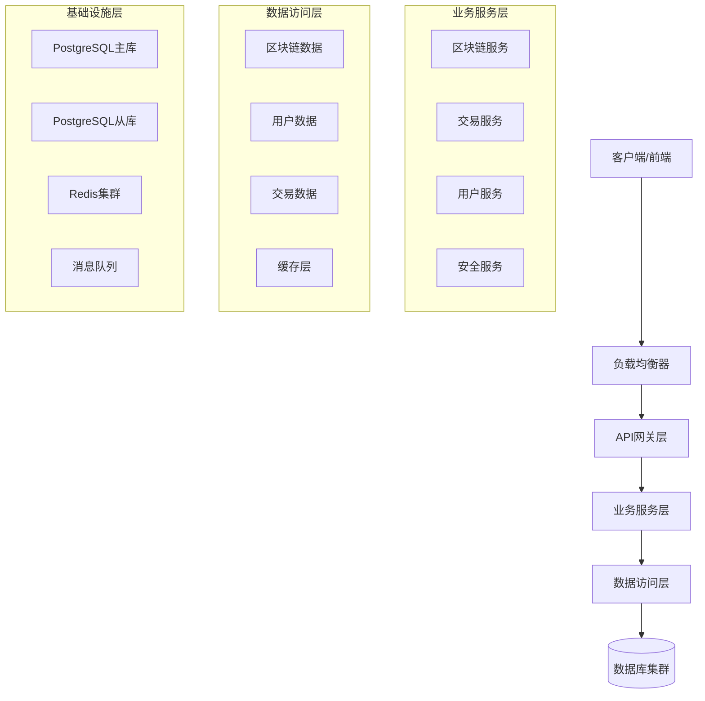
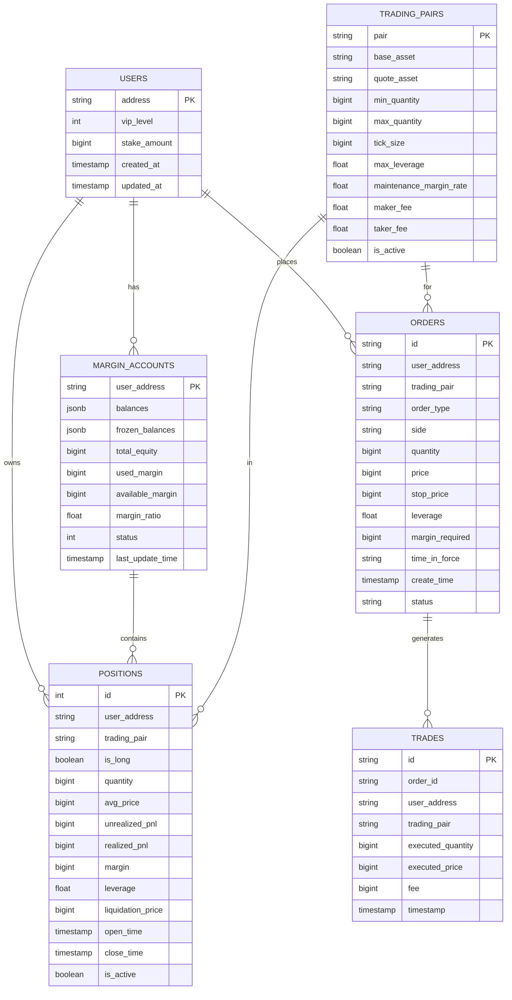
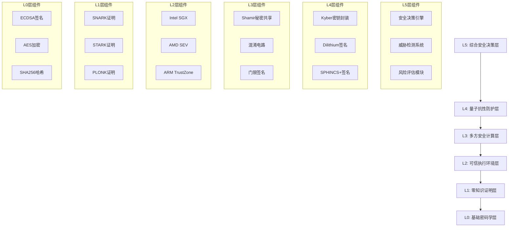

# TitanChain 技术架构文档 - 最终版

## 1. 架构设计



## 2. 技术描述

### 2.1 核心技术栈

- **前端**: React@18 + TypeScript + TailwindCSS + Vite
- **后端**: Node.js + Express + TypeScript
- **区块链**: 自研TitanChain核心 + EVM兼容层
- **数据库**: PostgreSQL + Redis
- **安全**: MPC + TEE + 量子抗性密码学
- **部署**: Docker + Docker Compose + Nginx

### 2.2 关键组件

#### 混合双区块架构
- **快速区块**: 1秒出块，5M Gas限制，处理简单交易
- **批量区块**: 5秒出块，50M Gas限制，处理复杂交易
- **智能路由**: 根据交易复杂度自动选择处理链路

#### 分层性能处理
- **TIER_1**: 立即处理模式，<100ms延迟
- **TIER_2**: 批处理模式，1-3秒延迟  
- **TIER_3**: 计划处理模式，3-10秒延迟

#### 保证金交易系统
- **杠杆引擎**: 支持1-100倍杠杆交易
- **风险控制**: 实时保证金率监控和强制平仓
- **VIP等级**: 基于质押量的差异化服务

## 3. 路由定义

| 路由 | 用途 |
|------|------|
| / | 主页，显示网络概览和实时统计 |
| /explorer | 区块链浏览器，查看区块和交易 |
| /wallet | 钱包管理，资产查看和交易操作 |
| /trading | 保证金交易，杠杆交易和持仓管理 |
| /staking | 质押系统，节点质押和收益管理 |
| /vip | VIP中心，等级管理和权益展示 |
| /security | 安全控制台，系统监控和威胁检测 |
| /docs | 开发者文档，API和SDK说明 |

## 4. API定义

### 4.1 区块链核心API

**获取网络统计**
```
GET /api/v1/network/stats
```

响应:
| 参数名 | 参数类型 | 描述 |
|--------|----------|------|
| tps | number | 当前TPS |
| latency | number | 平均延迟(ms) |
| blockHeight | number | 当前区块高度 |
| validators | number | 验证节点数量 |

示例:
```json
{
  "tps": 50000,
  "latency": 95,
  "blockHeight": 1234567,
  "validators": 108
}
```

**获取区块信息**
```
GET /api/v1/blocks/:blockNumber
```

响应:
| 参数名 | 参数类型 | 描述 |
|--------|----------|------|
| number | number | 区块号 |
| hash | string | 区块哈希 |
| timestamp | number | 时间戳 |
| transactions | Transaction[] | 交易列表 |

### 4.2 保证金交易API

**创建杠杆订单**
```
POST /api/v1/margin/orders
```

请求:
| 参数名 | 参数类型 | 必填 | 描述 |
|--------|----------|------|------|
| tradingPair | string | 是 | 交易对 |
| side | string | 是 | 买卖方向 |
| quantity | string | 是 | 数量 |
| leverage | number | 是 | 杠杆倍数 |
| orderType | string | 是 | 订单类型 |

响应:
| 参数名 | 参数类型 | 描述 |
|--------|----------|------|
| orderId | string | 订单ID |
| status | string | 订单状态 |
| marginRequired | string | 所需保证金 |

### 4.3 安全系统API

**获取安全状态**
```
GET /api/v1/security/status
```

响应:
| 参数名 | 参数类型 | 描述 |
|--------|----------|------|
| mpcStatus | string | MPC系统状态 |
| teeStatus | string | TEE系统状态 |
| quantumStatus | string | 量子安全状态 |
| threatLevel | string | 威胁等级 |

## 5. 服务器架构图



## 6. 数据模型

### 6.1 数据模型定义



### 6.2 数据定义语言

**用户表 (users)**
```sql
-- 创建用户表
CREATE TABLE users (
    address VARCHAR(42) PRIMARY KEY,
    vip_level INTEGER DEFAULT 0,
    stake_amount BIGINT DEFAULT 0,
    created_at TIMESTAMP WITH TIME ZONE DEFAULT NOW(),
    updated_at TIMESTAMP WITH TIME ZONE DEFAULT NOW()
);

-- 创建索引
CREATE INDEX idx_users_vip_level ON users(vip_level);
CREATE INDEX idx_users_stake_amount ON users(stake_amount DESC);
```

**保证金账户表 (margin_accounts)**
```sql
-- 创建保证金账户表
CREATE TABLE margin_accounts (
    user_address VARCHAR(42) PRIMARY KEY REFERENCES users(address),
    balances JSONB DEFAULT '{}',
    frozen_balances JSONB DEFAULT '{}',
    total_equity BIGINT DEFAULT 0,
    used_margin BIGINT DEFAULT 0,
    available_margin BIGINT DEFAULT 0,
    margin_ratio DECIMAL(10,4) DEFAULT 0,
    status INTEGER DEFAULT 0,
    last_update_time TIMESTAMP WITH TIME ZONE DEFAULT NOW()
);

-- 创建索引
CREATE INDEX idx_margin_accounts_margin_ratio ON margin_accounts(margin_ratio);
CREATE INDEX idx_margin_accounts_status ON margin_accounts(status);
```

**持仓表 (positions)**
```sql
-- 创建持仓表
CREATE TABLE positions (
    id SERIAL PRIMARY KEY,
    user_address VARCHAR(42) REFERENCES users(address),
    trading_pair VARCHAR(20) NOT NULL,
    is_long BOOLEAN NOT NULL,
    quantity BIGINT NOT NULL,
    avg_price BIGINT NOT NULL,
    unrealized_pnl BIGINT DEFAULT 0,
    realized_pnl BIGINT DEFAULT 0,
    margin BIGINT NOT NULL,
    leverage DECIMAL(6,2) NOT NULL,
    liquidation_price BIGINT NOT NULL,
    open_time TIMESTAMP WITH TIME ZONE DEFAULT NOW(),
    close_time TIMESTAMP WITH TIME ZONE,
    is_active BOOLEAN DEFAULT TRUE
);

-- 创建索引
CREATE INDEX idx_positions_user_address ON positions(user_address);
CREATE INDEX idx_positions_trading_pair ON positions(trading_pair);
CREATE INDEX idx_positions_is_active ON positions(is_active);
CREATE INDEX idx_positions_liquidation_price ON positions(liquidation_price);
```

**订单表 (orders)**
```sql
-- 创建订单表
CREATE TABLE orders (
    id VARCHAR(64) PRIMARY KEY,
    user_address VARCHAR(42) REFERENCES users(address),
    trading_pair VARCHAR(20) NOT NULL,
    order_type VARCHAR(20) NOT NULL,
    side VARCHAR(10) NOT NULL,
    quantity BIGINT NOT NULL,
    price BIGINT,
    stop_price BIGINT,
    leverage DECIMAL(6,2) NOT NULL,
    margin_required BIGINT NOT NULL,
    time_in_force VARCHAR(10) DEFAULT 'GTC',
    create_time TIMESTAMP WITH TIME ZONE DEFAULT NOW(),
    status VARCHAR(20) DEFAULT 'pending'
);

-- 创建索引
CREATE INDEX idx_orders_user_address ON orders(user_address);
CREATE INDEX idx_orders_trading_pair ON orders(trading_pair);
CREATE INDEX idx_orders_status ON orders(status);
CREATE INDEX idx_orders_create_time ON orders(create_time DESC);
```

**交易对配置表 (trading_pairs)**
```sql
-- 创建交易对配置表
CREATE TABLE trading_pairs (
    pair VARCHAR(20) PRIMARY KEY,
    base_asset VARCHAR(10) NOT NULL,
    quote_asset VARCHAR(10) NOT NULL,
    min_quantity BIGINT NOT NULL,
    max_quantity BIGINT NOT NULL,
    tick_size BIGINT NOT NULL,
    max_leverage DECIMAL(6,2) NOT NULL,
    maintenance_margin_rate DECIMAL(6,4) NOT NULL,
    maker_fee DECIMAL(6,4) NOT NULL,
    taker_fee DECIMAL(6,4) NOT NULL,
    is_active BOOLEAN DEFAULT TRUE
);

-- 初始化数据
INSERT INTO trading_pairs (pair, base_asset, quote_asset, min_quantity, max_quantity, tick_size, max_leverage, maintenance_margin_rate, maker_fee, taker_fee) VALUES
('BTC/USDT', 'BTC', 'USDT', 1000000, 10000000000000, 100, 100.00, 0.0050, 0.0010, 0.0020),
('ETH/USDT', 'ETH', 'USDT', 10000000, 100000000000000, 1000, 50.00, 0.0075, 0.0010, 0.0020),
('TTN/USDT', 'TTN', 'USDT', 100000000, 1000000000000000, 10000, 20.00, 0.0100, 0.0005, 0.0015);
```

## 7. 安全架构

### 7.1 多层次安全防护



### 7.2 安全模块配置

**MPC系统配置**
```typescript
const MPC_CONFIG = {
  enabled_protocols: ['SHAMIR', 'GARBLED_CIRCUITS', 'THRESHOLD_SIGNATURE'],
  min_participants: 3,
  max_participants: 10,
  threshold: 2,
  session_timeout_ms: 300000,
  max_concurrent_sessions: 100
};
```

**TEE系统配置**
```typescript
const TEE_CONFIG = {
  platforms: ['SGX', 'SEV', 'TRUSTZONE'],
  attestation_required: true,
  secure_channel_required: true,
  key_derivation_required: true,
  performance_monitoring: true
};
```

**量子安全配置**
```typescript
const QUANTUM_CONFIG = {
  enabled_algorithms: ['KYBER', 'DILITHIUM', 'SPHINCS_PLUS'],
  key_sizes: {
    kyber: 1024,
    dilithium: 2048,
    sphincs: 256
  },
  migration_strategy: 'HYBRID'
};
```

## 8. 性能优化

### 8.1 缓存策略

- **Redis集群**: 分布式缓存，支持高并发读写
- **本地缓存**: 热点数据本地缓存，减少网络延迟
- **CDN加速**: 静态资源全球分发，提升访问速度

### 8.2 数据库优化

- **读写分离**: 主库写入，从库读取，提升并发能力
- **分库分表**: 按用户和时间维度分片，支持海量数据
- **索引优化**: 针对查询模式优化索引，提升查询性能

### 8.3 网络优化

- **负载均衡**: 多实例部署，智能流量分发
- **连接池**: 数据库连接池，减少连接开销
- **压缩传输**: Gzip压缩，减少网络传输量