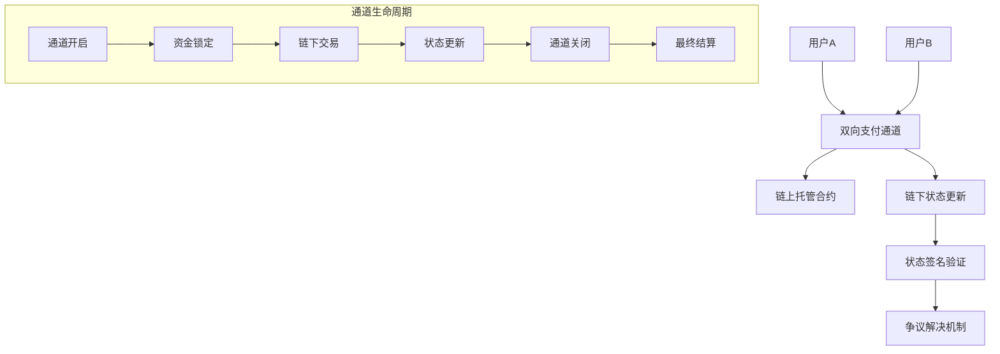
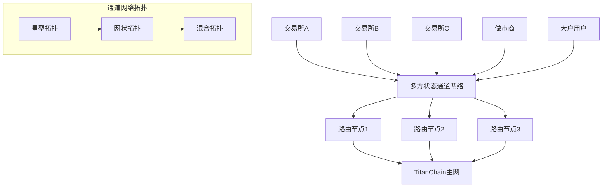

# TitanChain 方案三：状态通道 + 原子交换技术方案

## 1. 方案概述

状态通道 + 原子交换方案是TitanChain流动性共享机制的完全去中心化解决方案。该方案通过链下状态通道实现高频交易，通过原子交换保证跨交易所资金安全，用户资金完全自主控制，无需信任任何第三方托管。

### 1.1 核心设计理念
- **完全去中心化**：用户资金完全自主控制
- **高性能扩展**：链下交易处理，大幅提升TPS
- **原子安全性**：通过HTLC确保交易原子性
- **跨链互操作**：支持多链原子交换
- **智能路由**：自动寻找最优交易路径

## 2. 状态通道架构设计

### 2.1 双向支付通道

### 2.2 多方状态通道网络

## 3. 核心技术实现

### 3.1 HTLC哈希时间锁合约
- **原子性保证**：通过哈希锁和时间锁确保交易原子性
- **跨链支持**：支持不同区块链间的原子交换
- **安全机制**：超时自动退款，防止资金锁定
- **隐私保护**：使用哈希值隐藏交易细节

### 3.2 状态通道管理
- **双向通道**：支持双方资金双向流动
- **多方扩展**：可扩展到多方参与的复杂网络
- **状态同步**：实时同步链下状态变更
- **争议解决**：完善的链上争议仲裁机制

### 3.3 流动性路由优化
- **智能路径**：使用Dijkstra算法寻找最优路径
- **成本优化**：综合考虑手续费和滑点成本
- **多跳支持**：支持多个中间节点的复杂路由
- **实时更新**：动态调整路由策略

## 4. 技术优势

### 4.1 完全去中心化
- **用户自主**：资金完全由用户控制，无托管风险
- **无需信任**：不依赖任何中心化机构
- **抗审查性**：无法被单点关闭或控制
- **透明公开**：所有规则通过智能合约执行

### 4.2 高性能扩展
- **链下处理**：大部分交易在链下完成，提升TPS
- **即时确认**：链下交易即时确认，无需等待区块确认
- **批量结算**：定期批量上链，降低链上负载
- **并行处理**：多个通道可并行处理交易

### 4.3 低成本运营
- **减少Gas费**：大幅减少链上交易次数
- **批量优化**：批量结算降低平均成本
- **路径优化**：智能路由减少交易成本
- **竞争定价**：多路径竞争降低整体费用

## 5. 实施策略

### 5.1 分阶段部署
1. **第一阶段**：基础双方通道和HTLC实现
2. **第二阶段**：多方网络和路由算法
3. **第三阶段**：跨链支持和性能优化
4. **第四阶段**：生态推广和规模化应用

### 5.2 风险控制
- **安全审计**：多轮安全审计确保合约安全
- **渐进部署**：小规模测试后逐步扩大
- **监控系统**：实时监控网络状态和异常
- **应急机制**：完善的应急响应和恢复机制

### 5.3 生态建设
- **开发者工具**：提供完整的SDK和文档
- **激励机制**：为早期参与者提供激励
- **合作伙伴**：与主要交易所建立合作关系
- **社区治理**：建立去中心化治理机制

## 6. 商业价值

### 6.1 对交易所
- **成本降低**：显著降低运营成本
- **竞争优势**：接入全网流动性提升竞争力
- **技术创新**：展示技术领先地位
- **用户增长**：吸引注重安全的用户

### 6.2 对用户
- **资金安全**：完全自主控制，零托管风险
- **最优价格**：全网流动性聚合获得最优价格
- **快速交易**：链下即时交易确认
- **低手续费**：减少链上操作降低成本

### 6.3 对生态
- **技术推进**：推动Layer2和跨链技术发展
- **标准制定**：建立行业技术标准
- **生态繁荣**：促进整个DeFi生态发展
- **创新引领**：引领去中心化交易新方向

## 7. 总结

方案三：状态通道 + 原子交换代表了TitanChain在去中心化流动性共享领域的最前沿探索。通过完全去中心化的技术架构，为用户提供了既安全又高效的交易环境，同时为整个区块链生态的发展贡献了重要的技术创新。

这个方案虽然技术复杂度较高，但其带来的完全去中心化、高性能扩展和低成本运营等优势，使其成为TitanChain流动性共享机制的重要技术选择。通过分阶段实施和完善的风险控制，这个方案有望成为区块链交易领域的重要技术突破。