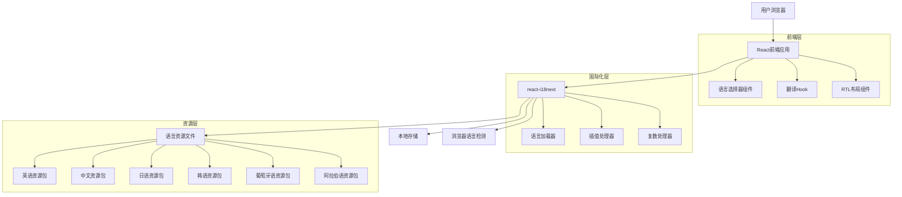
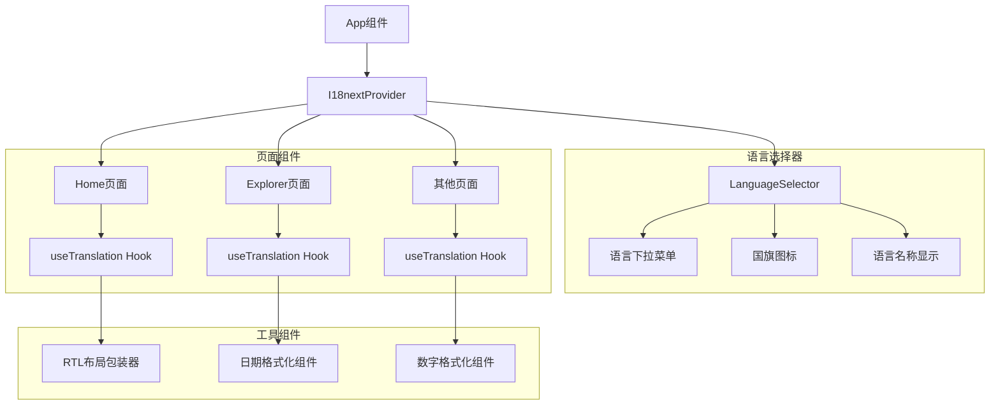
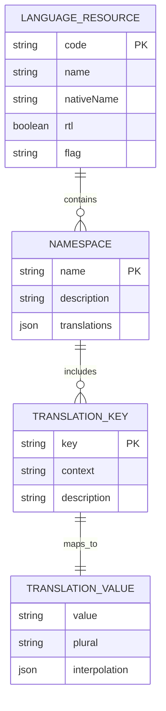

# TitanChain 多语言国际化技术架构文档

## 1. 架构设计



## 2. 技术描述

- **前端**: React@18 + react-i18next@13 + tailwindcss@3 + vite
- **国际化框架**: react-i18next (基于i18next)
- **状态管理**: Zustand (用于语言状态管理)
- **本地存储**: localStorage (语言偏好持久化)

## 3. 路由定义

| 路由 | 用途 |
|------|------|
| / | 首页，支持多语言的网络统计和功能介绍 |
| /explorer | 区块浏览器，本地化的区块和交易信息 |
| /staking | 质押页面，多语言的质押操作界面 |
| /governance | 治理页面，本地化的提案和投票功能 |
| /validators | 验证者页面，多语言的验证者信息展示 |
| /wallet | 钱包页面，本地化的钱包管理功能 |

## 4. 国际化API定义

### 4.1 核心配置API

**i18n初始化配置**
```typescript
// i18n配置接口
interface I18nConfig {
  lng: string;
  fallbackLng: string;
  resources: Record<string, any>;
  interpolation: {
    escapeValue: boolean;
  };
  detection: {
    order: string[];
    caches: string[];
  };
}
```

**语言切换API**
```typescript
// 语言切换函数
const changeLanguage = (language: string) => Promise<void>

// 当前语言获取
const getCurrentLanguage = () => string

// 支持的语言列表
const getSupportedLanguages = () => LanguageOption[]
```

### 4.2 翻译Hook API

**useTranslation Hook**
```typescript
interface UseTranslationReturn {
  t: (key: string, options?: any) => string;
  i18n: i18n;
  ready: boolean;
}

// 使用示例
const { t, i18n, ready } = useTranslation('common');
```

**翻译函数参数**
| 参数名称 | 参数类型 | 是否必需 | 描述 |
|----------|----------|----------|------|
| key | string | true | 翻译键名 |
| options | object | false | 插值参数和选项 |
| defaultValue | string | false | 默认值 |
| count | number | false | 复数处理的数量 |

响应示例：
```json
{
  "translatedText": "欢迎使用TitanChain",
  "language": "zh",
  "namespace": "common"
}
```

### 4.3 语言检测API

**浏览器语言检测**
```typescript
// 检测浏览器语言
const detectBrowserLanguage = () => string

// 语言匹配
const matchLanguage = (detected: string, supported: string[]) => string
```

## 5. 组件架构图



## 6. 数据模型

### 6.1 语言资源数据结构



### 6.2 语言配置定义

**支持的语言配置**
```typescript
// 语言配置表
const SUPPORTED_LANGUAGES = [
  {
    code: 'en',
    name: 'English',
    nativeName: 'English',
    flag: '🇺🇸',
    rtl: false
  },
  {
    code: 'zh',
    name: 'Chinese',
    nativeName: '中文',
    flag: '🇨🇳',
    rtl: false
  },
  {
    code: 'ja',
    name: 'Japanese',
    nativeName: '日本語',
    flag: '🇯🇵',
    rtl: false
  },
  {
    code: 'ko',
    name: 'Korean',
    nativeName: '한국어',
    flag: '🇰🇷',
    rtl: false
  },
  {
    code: 'pt',
    name: 'Portuguese',
    nativeName: 'Português',
    flag: '🇵🇹',
    rtl: false
  },
  {
    code: 'ar',
    name: 'Arabic',
    nativeName: 'العربية',
    flag: '🇸🇦',
    rtl: true
  }
];
```

**翻译文件结构**
```typescript
// 通用翻译文件结构 (common.json)
{
  "navigation": {
    "home": "首页",
    "explorer": "区块浏览器",
    "staking": "质押",
    "governance": "治理",
    "validators": "验证者",
    "wallet": "钱包"
  },
  "common": {
    "loading": "加载中...",
    "error": "错误",
    "success": "成功",
    "confirm": "确认",
    "cancel": "取消",
    "save": "保存"
  },
  "wallet": {
    "connect": "连接钱包",
    "disconnect": "断开连接",
    "connecting": "连接中...",
    "connected": "已连接",
    "balance": "余额",
    "address": "地址"
  },
  "network": {
    "tps": "TPS",
    "gasPrice": "Gas价格",
    "validators": "验证者",
    "blockTime": "出块时间",
    "totalSupply": "总供应量"
  },
  "errors": {
    "walletNotFound": "未找到钱包",
    "connectionFailed": "连接失败",
    "transactionFailed": "交易失败",
    "networkError": "网络错误"
  },
  "formats": {
    "currency": "{{value, currency}}",
    "number": "{{value, number}}",
    "date": "{{value, datetime}}",
    "percentage": "{{value, percent}}"
  }
}
```

**命名空间组织**
```typescript
// 翻译命名空间配置
const NAMESPACES = {
  common: '通用翻译',
  home: '首页内容',
  explorer: '区块浏览器',
  wallet: '钱包相关',
  staking: '质押功能',
  governance: '治理功能',
  validators: '验证者信息',
  errors: '错误信息'
};
```

**RTL语言支持配置**
```typescript
// RTL语言样式配置
const RTL_STYLES = {
  direction: 'rtl',
  textAlign: 'right',
  marginLeft: 'auto',
  marginRight: '0',
  paddingLeft: 'auto',
  paddingRight: '0'
};

// RTL语言检测
const isRTL = (language: string) => ['ar', 'he', 'fa'].includes(language);
```