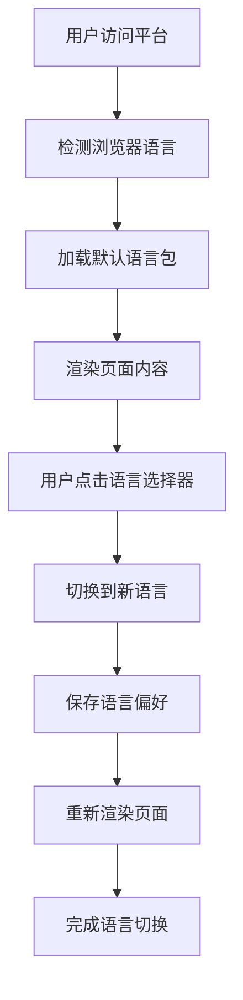

# TitanChain 多语言国际化需求文档

## 1. 产品概述

TitanChain前端多语言国际化模块旨在为全球用户提供本地化的区块链浏览器和钱包体验，支持6种主要语言，提升用户体验和全球市场覆盖率。

- 该模块将为TitanChain区块链平台提供完整的多语言支持，让不同语言背景的用户都能流畅使用平台功能。
- 目标是实现无缝的语言切换体验，提升平台的国际化水平和用户满意度。

## 2. 核心功能

### 2.1 用户角色

| 角色 | 使用方式 | 核心权限 |
|------|----------|----------|
| 普通用户 | 直接访问平台 | 可选择语言、浏览内容、使用基础功能 |
| 高级用户 | 连接钱包后使用 | 可进行交易、质押、治理等高级操作 |

### 2.2 功能模块

多语言国际化需求包含以下主要页面：
1. **语言选择器**：语言切换组件、自动检测、本地存储
2. **首页**：网络统计、功能介绍、候补节点展示的多语言支持
3. **区块浏览器**：区块信息、交易详情、验证者列表的本地化
4. **钱包连接**：连接状态、错误提示、操作反馈的多语言
5. **质押页面**：质押操作、收益展示、风险提示的本地化
6. **治理页面**：提案列表、投票界面、治理规则的翻译

### 2.3 页面详情

| 页面名称 | 模块名称 | 功能描述 |
|----------|----------|----------|
| 语言选择器 | 语言切换组件 | 提供6种语言选择、实时切换、记忆用户偏好 |
| 语言选择器 | 自动检测模块 | 根据浏览器语言自动选择、智能回退机制 |
| 首页 | 网络统计区域 | TPS、Gas费用、验证者数量等数据的本地化显示 |
| 首页 | 功能介绍区域 | 平台特性、优势介绍的多语言内容 |
| 首页 | 候补节点展示 | 节点状态、安全评分等信息的本地化 |
| 区块浏览器 | 区块信息展示 | 区块高度、时间戳、交易数量的格式化显示 |
| 区块浏览器 | 交易详情页面 | 交易哈希、状态、金额等信息的本地化 |
| 钱包连接 | 连接状态显示 | 连接成功、失败、等待状态的多语言提示 |
| 钱包连接 | 错误处理模块 | 各种错误情况的本地化错误信息 |
| 质押页面 | 质押操作界面 | 质押金额、期限、收益预估的本地化 |
| 质押页面 | 收益展示区域 | 历史收益、当前收益率的格式化显示 |
| 治理页面 | 提案列表 | 提案标题、描述、状态的多语言支持 |
| 治理页面 | 投票界面 | 投票选项、确认提示的本地化 |

## 3. 核心流程

**用户语言切换流程：**
用户访问平台 → 自动检测浏览器语言 → 显示对应语言内容 → 用户可手动切换语言 → 保存语言偏好到本地存储 → 下次访问自动应用用户偏好

**多语言内容加载流程：**
页面初始化 → 检测当前语言设置 → 动态加载对应语言包 → 渲染本地化内容 → 监听语言切换事件 → 重新加载新语言内容

## 4. 用户界面设计

### 4.1 设计风格

- **主色调**：保持TitanChain品牌色彩（蓝色渐变 #3B82F6 到 #1E40AF）
- **按钮样式**：圆角设计，支持RTL语言的镜像布局
- **字体**：支持多语言字符集，中文使用思源黑体，阿拉伯语使用Noto Sans Arabic
- **布局风格**：响应式设计，支持从右到左（RTL）语言布局
- **图标样式**：使用Lucide React图标库，支持国际化图标

### 4.2 页面设计概览

| 页面名称 | 模块名称 | UI元素 |
|----------|----------|---------|
| 语言选择器 | 下拉菜单 | 国旗图标、语言名称、平滑动画效果、响应式设计 |
| 语言选择器 | 移动端适配 | 底部弹出菜单、大按钮设计、易于触摸操作 |
| 首页 | 多语言横幅 | 渐变背景、多语言欢迎文字、动态切换效果 |
| 区块浏览器 | 数据表格 | 本地化的表头、日期时间格式、数字格式化 |
| 钱包连接 | 状态指示器 | 多语言状态文字、颜色编码、加载动画 |
| 错误提示 | 消息框 | 本地化错误信息、操作建议、关闭按钮 |

### 4.3 响应式设计

- **桌面端优先**：主要针对桌面浏览器优化，支持大屏幕显示
- **移动端适配**：响应式布局，语言选择器在移动端使用底部弹出设计
- **RTL语言支持**：阿拉伯语等从右到左语言的完整布局适配
- **触摸优化**：移动端语言切换按钮增大，提升触摸体验